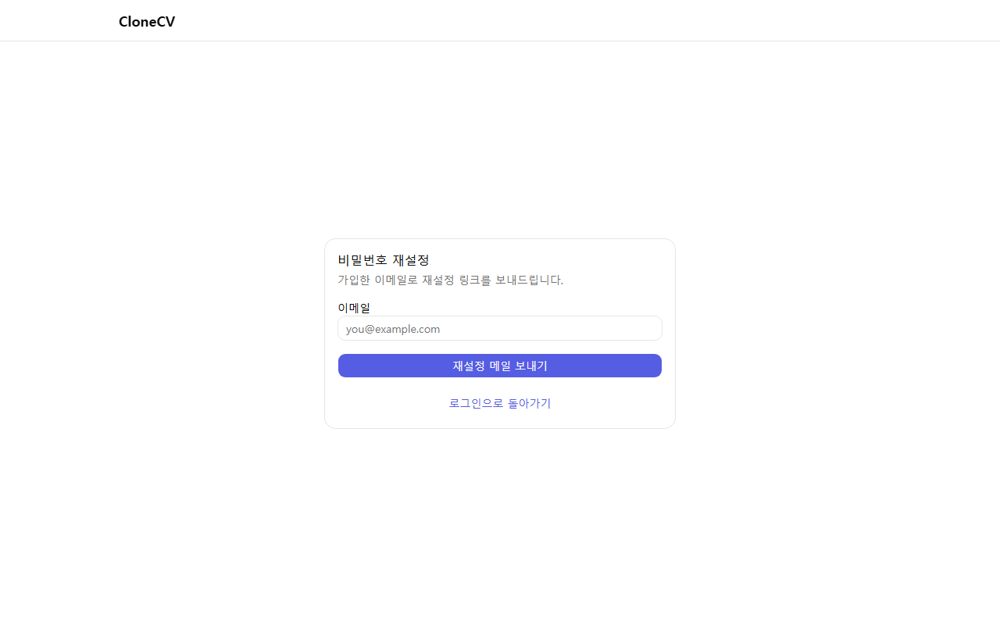

# CloneCV (my-ai-resume)

**이력서 대신, 나와 대화하는 AI 클론 링크를 제출하세요.**

CloneCV는 지원자가 구조화된 이력서를 입력하면, 그 내용을 학습한 **AI 클론(챗봇)** 이 생성되는 서비스입니다. 발행 후 `/@슬러그` 링크 하나로 **웹 이력서 + 실시간 AI 면접**을 동시에 공유할 수 있습니다. 채용 담당자는 PDF를 읽는 대신 AI에게 직접 질문하며 지원자의 기술 깊이와 경험을 사전에 확인할 수 있습니다.

---

## 목차

- [프로젝트 개요](#프로젝트-개요)
- [핵심 가치](#핵심-가치)
- [사용자 흐름](#사용자-흐름)
- [구현된 기능](#구현된-기능)
- [기술 스택](#기술-스택)
- [로컬 실행](#로컬-실행)
- [테스트](#테스트)
- [배포](#배포)
- [문서](#문서)
- [향후 작업](#향후-작업)

---

## 프로젝트 개요

| 항목 | 내용 |
|------|------|
| **서비스명** | CloneCV |
| **한 줄 정의** | 이력서 데이터 기반 AI 클론을 만들어 `/@ID` 링크로 공유하는 대화형 이력서 서비스 |
| **타깃** | IT 취업 준비생, 주니어~미들 이직자 |
| **MVP 상태** | F-01~F-09 전 기능 구현 완료 + 2026-07-05 이후 11개 확장 기능 추가 |
| **과금** | 무료 (Gemini 무료 티어 + Upstash 무료 티어 기준) |

### 문제 정의

전통적인 PDF/웹 이력서는 **정적**입니다. 면접관은 지원자의 실제 역량·트러블슈팅 경험·커뮤니케이션을 사전에 검증하기 어렵습니다. CloneCV는 이력서를 **대화 가능한 AI 페르소나**로 변환해, "읽기"가 아닌 **"질문하기"** 로 지원자를 파악할 수 있게 합니다.

### 솔루션

1. 지원자가 **구조화된 폼**으로 이력서 입력 (경력, 프로젝트 STAR, 기술 스택 등)
2. 서버가 입력 데이터를 **시스템 프롬프트**로 조합 (LLM 재생성 없이 템플릿 방식 → 비용·지연 최소)
3. `/@슬러그` 퍼블릭 페이지에서 **이력서 뷰 + AI 챗봇** 동시 제공
4. 소유자는 **대시보드**에서 방문자 대화 로그·조회 통계 확인

### 아키텍처 요약

```
[방문자/지원자] → Next.js (Vercel)
                    ├── Supabase (Auth, Postgres, Storage, RLS)
                    ├── Google Gemini (채팅 + PDF 추출)
                    └── Upstash Redis (레이트리밋)
```

- **RAG 방식:** MVP는 pgvector 없이 **Full-context Prompt** — 프로필 데이터 전체를 시스템 프롬프트에 삽입
- **보안:** RLS, 시스템 프롬프트 클라이언트 비노출, 프롬프트 인젝션 방어, 민감정보 후처리 필터

---

## 핵심 가치

| 대상 | 가치 |
|------|------|
| **지원자** | 이력서 한 번 작성 → AI 클론 + 공유 링크 자동 생성, 면접관이 무엇을 물었는지 대화 로그로 확인 |
| **면접관(방문자)** | 로그인 없이 AI와 실시간 대화, 추천 질문 칩으로 빠른 탐색 |
| **서비스** | 퍼블릭 프로필 워터마크 + 소셜 공유로 바이럴 유입 |

---

## 사용자 흐름

```
회원가입/로그인 → 슬러그 설정(온보딩) → 이력서 작성(자동저장)
    → 발행(시스템 프롬프트 생성) → /@슬러그 공유
        → 방문자 AI 대화 → 소유자 대시보드에서 로그·통계 확인
```

---

## 구현된 기능

### 1. 랜딩 페이지

서비스 소개, 3단계 이용 방법, FAQ, AI 대화 미리보기, 예시 프로필 링크, CTA(무료로 시작하기). 라이트/다크 모드 지원.


---

### 2. 인증 (회원가입 · 로그인 · 비밀번호 재설정)

| 기능 | 경로 | 설명 |
|------|------|------|
| 회원가입 | `/signup` | 이메일·비밀번호 또는 Google OAuth |
| 로그인 | `/login` | 성공 시 대시보드 또는 온보딩으로 이동 |
| 비밀번호 재설정 | `/forgot-password`, `/reset-password` | Supabase Auth 이메일 기반 |



<table>
<tr>
<td width="50%">

**회원가입** — Google OAuth 또는 이메일 가입. 가입 후 슬러그 온보딩으로 이동합니다.


</td>
<td width="50%">

**로그인** — 기존 계정으로 로그인. 비밀번호 찾기 링크 제공.


</td>
</tr>
</table>

---

### 3. 슬러그 온보딩

**경로:** `/onboarding`

- 영문·숫자·하이픈 3~20자 고유 ID 설정
- 실시간 중복 검사(debounce), 예약어(admin, api, login 등) 차단
- 완료 후 `/@슬러그` 형태로 퍼블릭 URL 사용

> 인증 필요 화면 — 스크린샷은 로컬 로그인 후 캡처 가능

---

### 4. 이력서 빌더

**경로:** `/dashboard/edit`

MVP 4단계 폼에서 **7섹션 연속 스크롤 UI**로 확장되었습니다.

| 섹션 | 내용 |
|------|------|
| 기본 정보 | 이름, 직무, 한줄소개, 프로필 사진, 생년, 연락처, SNS 링크 |
| 경력 | 회사·직책·기간·설명 (토글 on/off) |
| 학력·자격증 | 학교·전공·학위, 자격증 목록 (토글) |
| 기술 스택 | 태그 입력 + 숙련도, 인기 기술 자동완성 |
| 프로젝트 | 최대 3개, STAR + 트러블슈팅 구조 |
| 자기소개서 | 제목·본문 (토글) |
| 예상 질문 답변 | 면접 예상 Q&A — AI 프롬프트 전용, 퍼블릭 미노출 |

**부가 기능**

- **자동 저장:** 필드 blur + 30초 간격 draft 저장
- **완성도 카드:** 섹션별 채움률 + 미완료 바로가기
- **PDF 업로드:** 기존 이력서 PDF → Gemini 추출 → 폼 자동 채우기(merge/diff)
- **발행:** 시스템 프롬프트 생성 → `status: published`

> 인증 필요 화면 — 스크린샷은 로컬 로그인 후 캡처 가능

---

### 5. 퍼블릭 프로필 + AI 챗봇

**경로:** `/@슬러그` (예: `/@growjong`)

| 영역 | 내용 |
|------|------|
| 좌측 (데스크톱) | 이력서: 기본정보, 경력, 학력·자격증, 기술 스택, 프로젝트 아코디언 |
| 우측 (데스크톱) | AI 챗봇: 스트리밍 답변, 동적 추천 질문 칩, 세션 유지 |
| 모바일 | 이력서 / 채팅 탭 전환 |
| 하단 | 워터마크 CTA ("무료로 만들기") |
| 공유 | 카카오톡, X, 링크 복사 |
| SEO | OG 메타·동적 OG 이미지 (`opengraph-image.tsx`) |
| 신고 | 방문자 신고 버튼 → 관리자 모더레이션 |

**AI 챗봇 보안**

- 입력 이력서 데이터만 근거로 1인칭 답변
- 연봉·주민번호 등 민감 질문 가드레일 + 후처리 필터
- Upstash Redis 레이트리밋 (분당 5회, 일 50회)
- 시스템 프롬프트 원문 클라이언트 비노출

<table>
<tr>
<td>

**데스크톱** — 좌측 이력서 + 우측 AI 채팅 분할 레이아웃


</td>
<td>

**모바일** — 이력서 / 채팅 탭 전환 UI


</td>
</tr>
</table>

---

### 6. 소유자 대시보드

**경로:** `/dashboard`

| 탭 | 기능 |
|----|------|
| 프로필 관리 | 링크 복사, 비공개 토글, 수정하기, 공개 프로필 새 탭 미리보기, **PDF 다운로드**, **완성도 카드** |
| 대화 로그 | 날짜별 chat_sessions 목록 → 전체 메시지 열람 |
| 통계 | view_count, 세션 수, 최근 7일 추이(recharts) |

> 인증 필요 화면

---

### 7. 관리자 모더레이션

**경로:** `/admin` (Supabase `app_metadata.role = "admin"`)

- 신고 목록 조회
- 프로필 강제 비공개 처리
- 신고 처리 완료 표시

> 인증 + admin role 필요

---

### 8. MVP 이후 확장 기능 요약

| 기능 | 설명 |
|------|------|
| PDF import/export | `@react-pdf/renderer` + Gemini PDF 추출 |
| 섹션 토글 | 경력/학력/자기소개 on-off |
| Owner FAQ | 예상 면접 Q&A → 시스템 프롬프트만 반영 |
| 완성도 | 섹션별 진행률 |
| 다크모드 | `next-themes` 전역 테마 |
| 동적 추천 질문 | 프로필 데이터 기반 챗봇 칩 |
| birth_year | 생년만 저장, 공개 프로필 만 나이 표시 |

상세: [`docs/07_현황감사.md`](docs/07_현황감사.md), [`docs/02_기능명세서.md`](docs/02_기능명세서.md) F-10~

---

## 기술 스택

| 영역 | 기술 |
|------|------|
| Framework | Next.js 16 (App Router) + TypeScript + React 19 |
| UI | Tailwind CSS v4 + shadcn/ui + recharts + next-themes |
| Backend | Supabase (Auth, Postgres, Storage, RLS) |
| AI | Google Gemini API (`gemini-2.5-flash` 기본) |
| Rate limit | Upstash Redis |
| PDF | `@react-pdf/renderer`, Gemini PDF 추출 |
| Form | React Hook Form + Zod + Zustand |
| Test | Vitest + Playwright |
| Deploy | Vercel |

---

## 로컬 실행

### 사전 준비

1. [Node.js](https://nodejs.org/) 20+
2. [Supabase](https://supabase.com/) 프로젝트
3. [Google AI Studio](https://aistudio.google.com/) Gemini API 키
4. [Upstash](https://upstash.com/) Redis
5. (선택) [Kakao Developers](https://developers.kakao.com/) JS 키

### 실행

```bash
npm install
cp .env.local.example .env.local
# .env.local에 실제 키 입력

npm run db:push   # 마이그레이션 8개 적용
npm run dev
```

브라우저: [http://localhost:3000](http://localhost:3000)

### 주요 스크립트

| 명령 | 설명 |
|------|------|
| `npm run dev` | 개발 서버 |
| `npm run build` | 프로덕션 빌드 |
| `npm run test` | Vitest 단위 테스트 |
| `npm run test:e2e` | Playwright smoke (공개 페이지·auth guard) |
| `npm run test:e2e:integration` | Playwright 통합 (로그인→발행→채팅, `.env.local` 필요) |
| `npm run test:e2e:screenshots` | README 스크린샷 갱신 |
| `npm run db:push` | Supabase 마이그레이션 원격 적용 |
| `npm run db:types` | DB 타입 재생성 |
| `npm run lint` | ESLint |

### 환경변수

`.env.local.example` 참고.

| 변수 | 용도 |
|------|------|
| `NEXT_PUBLIC_SUPABASE_URL` | Supabase URL |
| `NEXT_PUBLIC_SUPABASE_ANON_KEY` | anon key |
| `SUPABASE_SERVICE_ROLE_KEY` | 서버 전용 |
| `GEMINI_API_KEY` | Gemini API |
| `UPSTASH_REDIS_REST_URL` / `TOKEN` | 레이트리밋 |
| `NEXT_PUBLIC_SITE_URL` | OG/공유/redirect |
| `NEXT_PUBLIC_KAKAO_JS_KEY` | (선택) 카카오 공유 |
| `GEMINI_MODEL` | (선택) 기본 `gemini-2.5-flash` |

### 관리자 계정

Supabase Auth → Users → `app_metadata`:

```json
{ "role": "admin" }
```

### 폴더 구조

```
app/
├── (marketing)/          # 랜딩
├── (auth)/               # login, signup, forgot-password, reset-password
├── (app)/                # onboarding, dashboard, dashboard/edit
├── admin/                # 관리자 모더레이션
├── [id]/                 # 퍼블릭 프로필 (/@slug → middleware rewrite)
└── api/                  # chat, prompt, resume, reports, admin, ...
components/
lib/
supabase/migrations/      # 8개 SQL 마이그레이션
docs/                     # 명세서 + 07_현황감사 + 08_개발일지
tests/                    # Vitest
e2e/                      # Playwright
middleware.ts
```

---

## 테스트

```bash
npm run test                     # Vitest
npm run test:e2e                 # Playwright smoke (CI 포함)
npm run test:e2e:integration     # 로그인→발행→채팅 (env 필요)
npm run test:e2e:screenshots     # README 스크린샷 갱신
npm run build                    # 빌드 검증
npm run lint                     # ESLint
```

E2E 최초 실행:

```bash
npx playwright install chromium
```

**통합 E2E** (`test:e2e:integration`)는 `.env.local`에 테스트 계정·Supabase·Gemini·Upstash 변수가 필요합니다. GitHub Actions에서는 Repository Secrets(`E2E_TEST_EMAIL` 등)를 등록하면 integration job이 실행됩니다. Secrets가 없으면 smoke만 실행됩니다.

---

## 배포

### 1. Supabase (DB) — 먼저 적용

```bash
npm run db:push
```

마이그레이션 순서 (8개):

1. `20260705150000_initial_schema.sql`
2. `20260705160000_avatars_storage.sql`
3. `20260705170000_profile_daily_stats.sql`
4. `20260705180000_admin_moderation.sql`
5. `20260705190000_reports_resolution.sql`
6. `20260705200000_resume_data_expansion.sql`
7. `20260705210000_profile_enabled_sections.sql`
8. `20260706000000_owner_faqs.sql`

### 2. Supabase Auth / Storage

- Email + Google OAuth
- Redirect URLs: Vercel 도메인 + `/auth/callback`
- 비밀번호 재설정: `{SITE_URL}/auth/callback?next=/reset-password`

### 3. Vercel

1. GitHub 저장소 연결
2. Environment Variables 등록
3. `NEXT_PUBLIC_SITE_URL` = 프로덕션 URL
4. Deploy

### 4. 배포 후 확인

- [ ] 회원가입 / 로그인 / 비밀번호 재설정
- [ ] 온보딩 → 이력서 발행 → `/@slug`
- [ ] AI 채팅, OG 이미지
- [ ] 대시보드 통계, PDF import/export
- [ ] 신고 → `/admin` 처리

---

## 문서

| 파일 | 용도 |
|------|------|
| [`docs/01_요구사항명세서.md`](docs/01_요구사항명세서.md) | FR 요구사항 (MVP v1.0) |
| [`docs/02_기능명세서.md`](docs/02_기능명세서.md) | F-01~F-20 기능 명세 |
| [`docs/03_기능분해도.md`](docs/03_기능분해도.md) | 기능 분해 트리 |
| [`docs/04_아키텍처명세서.md`](docs/04_아키텍처명세서.md) | 아키텍처·DB·API |
| [`docs/05_기술스택_서비스정리.md`](docs/05_기술스택_서비스정리.md) | 스택·환경변수 |
| [`docs/06_Cursor_시작프롬프트.md`](docs/06_Cursor_시작프롬프트.md) | Cursor 초기 구축 + **멀티 PC 이어하기** |
| [`docs/07_현황감사.md`](docs/07_현황감사.md) | 코드 vs 명세 감사, backlog |
| [`docs/08_개발일지.md`](docs/08_개발일지.md) | 세션별 작업 로그 (멀티 PC 공유용) |
| [`supabase/README.md`](supabase/README.md) | DB 마이그레이션 가이드 |

### 멀티 PC / Agent 이어하기

```bash
git pull   # 작업 시작
# Agent: @docs/07_현황감사.md @docs/08_개발일지.md @README.md
git push   # 작업 종료 (08_개발일지 갱신 포함)
```

---

## 향후 작업

| 항목 | 상태 |
|------|------|
| GitHub Actions CI | ✅ `push`/`PR` 시 lint · test · build (`.github/workflows/ci.yml`) |
| E2E 통합 시나리오 (로그인→발행→채팅) | ✅ `npm run test:e2e:integration` (env 필요) |
| middleware → proxy (Next.js 16) | deprecation 경고, 동작 정상 |
| Gemini Pro 유료 모델 | flash 기본 |
| 대시보드·빌더·온보딩 스크린샷 | 인증 필요 — 수동 캡처 |
| OG 이미지 커스텀 폰트 | 시스템 sans-serif |

backlog 상세: [`docs/07_현황감사.md`](docs/07_현황감사.md) §7
