# CloneCV

**이력서 PDF 하나 던지는 대신, 나와 대화할 수 있는 링크를 내보세요.**

CloneCV는 이력서를 입력하면 그 내용을 바탕으로 **AI 클론**이 만들어지는 서비스입니다. 발행 후 `/@슬러그` 주소 하나로 **웹 이력서**와 **실시간 채팅**을 함께 공유할 수 있습니다. 면접관은 문서를 끝까지 읽지 않아도, 궁금한 점을 바로 물어볼 수 있습니다.

> 처음 써보시려면 가상 프로필 **[@kimdev](https://my-ai-resume-alpha.vercel.app/@kimdev)** 에서 먼저 체험해 보세요. 실제 사용자 데이터가 아닌 예시 전용 프로필입니다.

---

## 한눈에 보기

|                            |                                                                   |
| -------------------------- | ----------------------------------------------------------------- |
| **누구를 위한 서비스인가** | IT 취업·이직 준비생, 포트폴리오를 링크로 넘기는 개발자            |
| **핵심 경험**              | 이력서 작성 → AI 클론 발행 → `/@id` 공유 → 방문자가 채팅으로 질문 |
| **비용**                   | Gemini·Upstash 무료 티어 기준으로 운영 가능 (개인 프로젝트 규모)  |
| **현재 상태**              | MVP + 한국 시장 맞춤 + 포트폴리오·RAG 기반 + 챗봇 답변 품질까지 구현, 프로덕션 배포 가능 수준 |

---

## 왜 만들었나

PDF 이력서는 읽히기도 전에 넘어가고, 웹 포트폴리오는 정적이라 **"이 사람한테 직접 물어보고 싶은 것"** 을 확인하기 어렵습니다. CloneCV는 이력서에 있는 사실만 근거로 1인칭 답변하는 AI를 붙여서, **읽기 → 대화** 로 전환하는 실험입니다.

---

## 화면 미리보기

### 랜딩 — 서비스 소개와 예시 링크

홈에서 바로 `@kimdev` 예시 프로필로 이동할 수 있습니다. 본인 프로필이 아닌 **가상의 김개발** 데이터만 보여 줍니다.

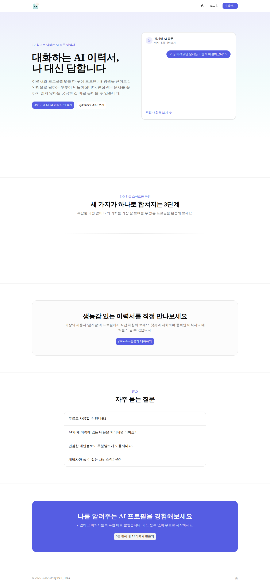

### 예시 프로필 — 이력서 + AI 채팅

상단 히어로 + 이력서 본문 구조이고, 데스크톱에서는 우측에 섹션 내비게이션 레일이 붙습니다. 채팅은 우하단 플로팅 버튼으로 열리는 별도 창입니다.

<table>
<tr>
<td width="50%">

**데스크톱** (`/@kimdev`)

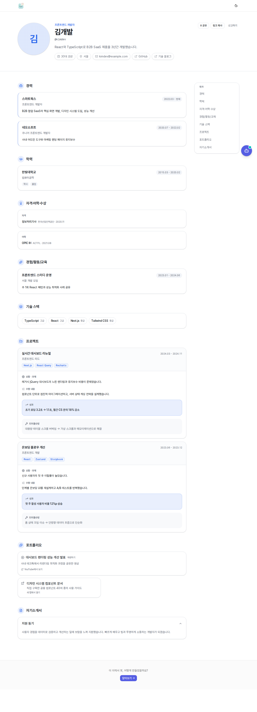

</td>
<td width="50%">

**모바일**

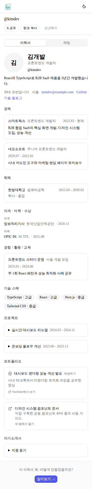

</td>
</tr>
</table>

### AI 채팅 — 우하단 플로팅 창

방문자가 우하단 버튼을 누르면 이력서 위에 채팅 창이 뜹니다. **추천 질문** 칩은 이력서에 근거가 있는 질문만 노출되고, 답변이 끝날 때마다 다음에 물어볼 질문으로 교체됩니다.

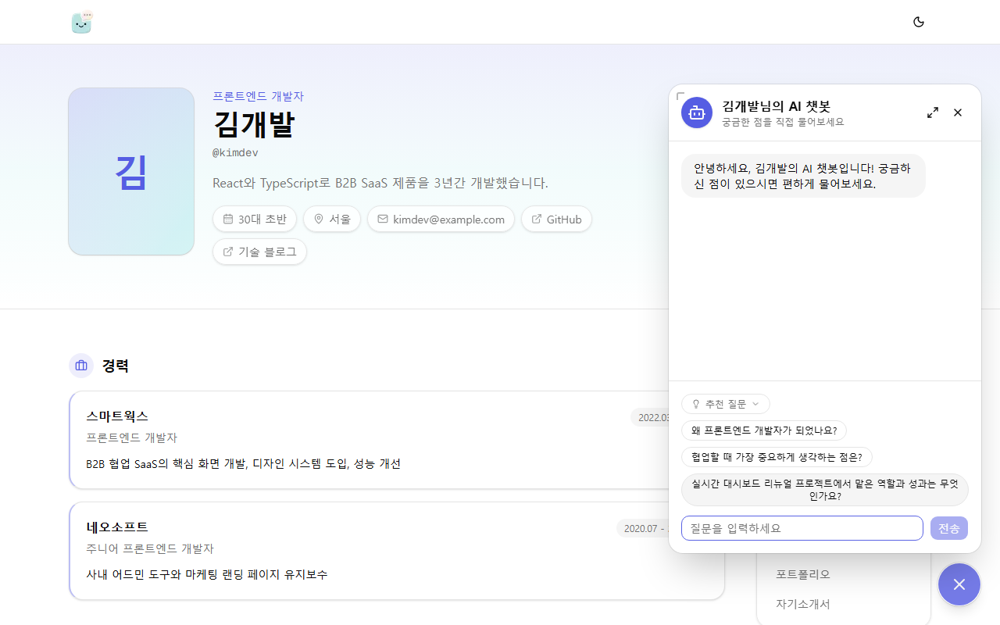

### 회원가입 · 로그인

이메일 또는 Google OAuth. 가입 후 슬러그(`/@원하는주소`)를 정하면 본인 프로필을 만들 수 있습니다.

<table>
<tr>
<td width="50%">

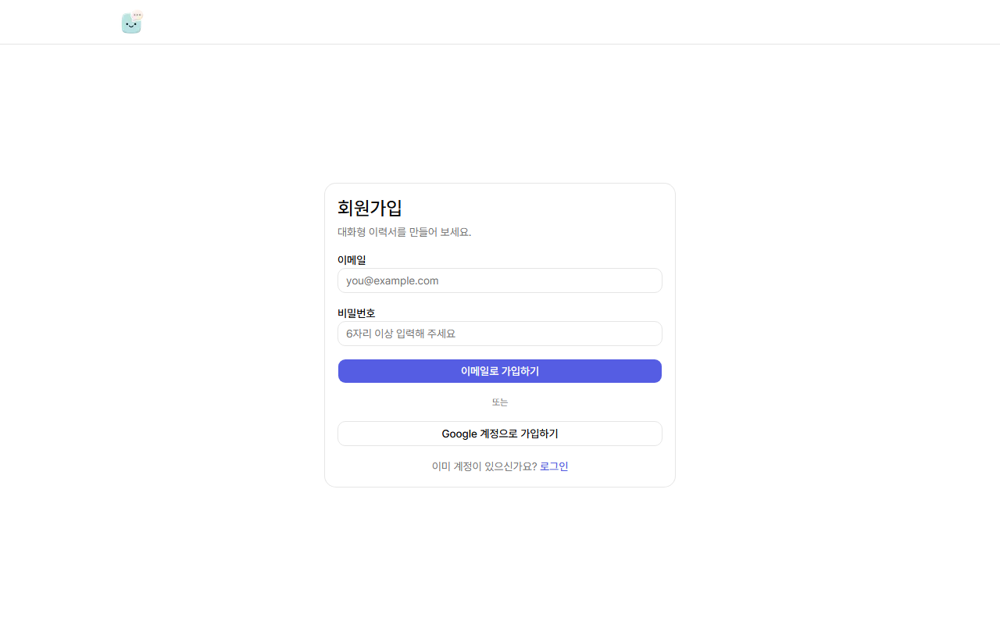

</td>
<td width="50%">

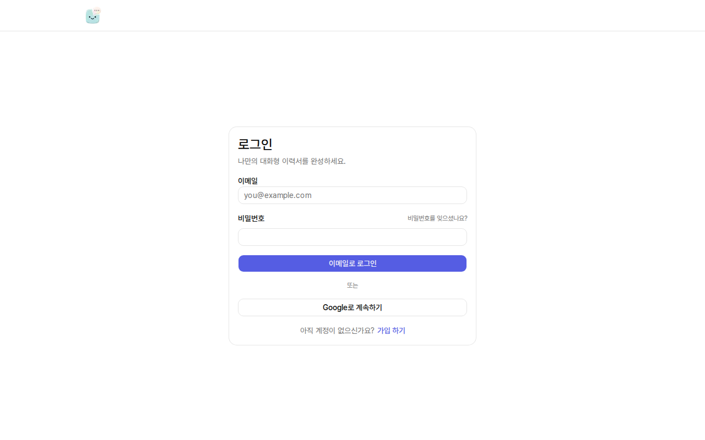

</td>
</tr>
</table>

> 빌더·대시보드·온보딩 화면은 로그인 없이 **`/demo/*` 예시 경로**에서 @kimdev 가상 데이터로 미리볼 수 있습니다. `npm run test:e2e:screenshots` 로 README 스크린샷을 갱신할 수 있습니다.

### 온보딩 — 슬러그 설정

가입 직후 `/@원하는주소` 형태의 고유 슬러그를 정합니다. 중복 확인 후 프로필 편집으로 이동합니다.

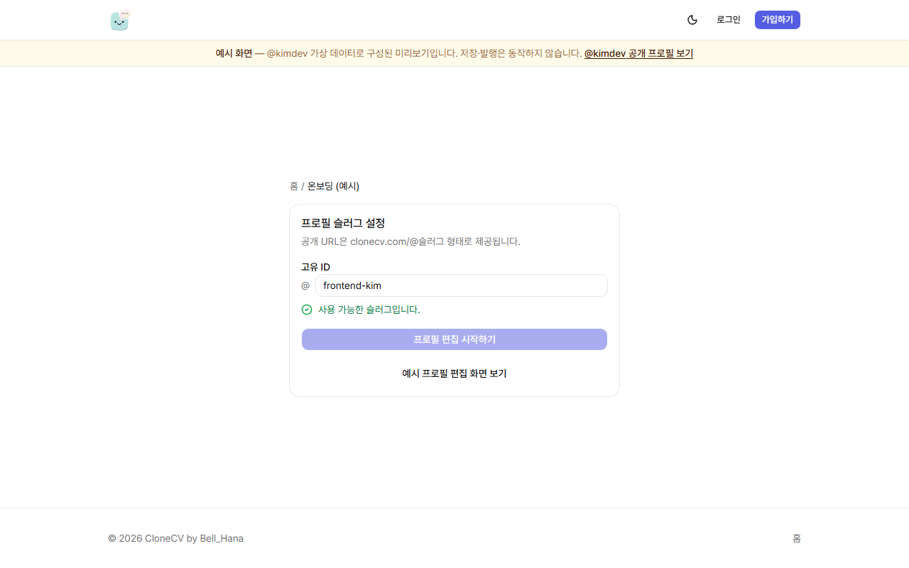

### 프로필 편집 — 이력서 빌더

10개 섹션을 사이드바에서 순서 변경·on/off 할 수 있습니다. blur·30초 간격 자동 저장, 완성도 카드, PDF 가져오기(Gemini 추출), 파일 드래그앤드롭 업로드, 공개 화면 미리보기를 지원합니다.

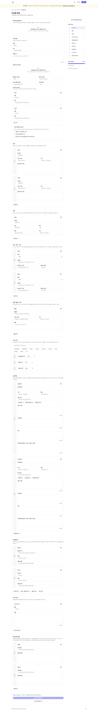

### 대시보드 — 프로필 관리

링크 복사, 비공개 전환, PDF 다운로드, **모의 면접** 연습을 한 화면에서 관리합니다.

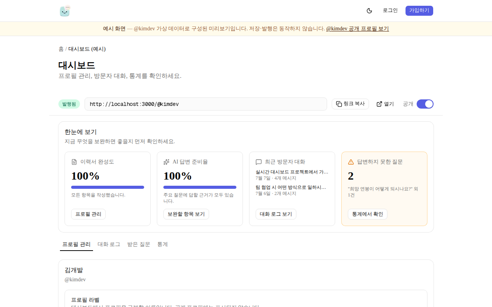

### 대시보드 — 대화 로그 · 통계 · 받은 질문

방문자가 AI에게 무엇을 물었는지 확인하고, 조회수·세션 추이를 보며, AI가 답하지 못한 문의를 받을 수 있습니다. 통계 탭의 **답변하지 못한 질문** 카드는 클론이 근거를 찾지 못한 질문을 모아 주고, 거기서 바로 **FAQ 답변 작성**으로 이어집니다.

<table>
<tr>
<td width="33%">

**대화 로그**

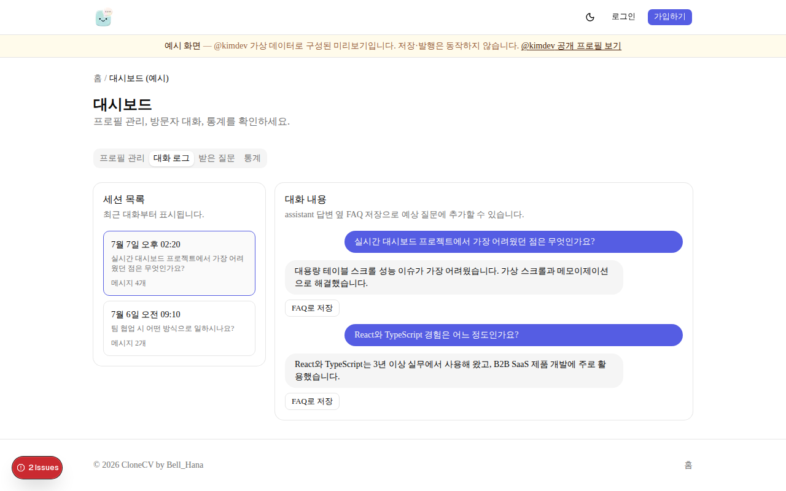

</td>
<td width="33%">

**통계**

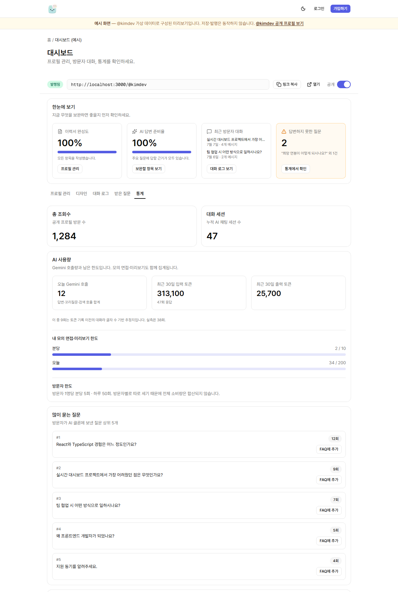

</td>
<td width="33%">

**받은 질문**

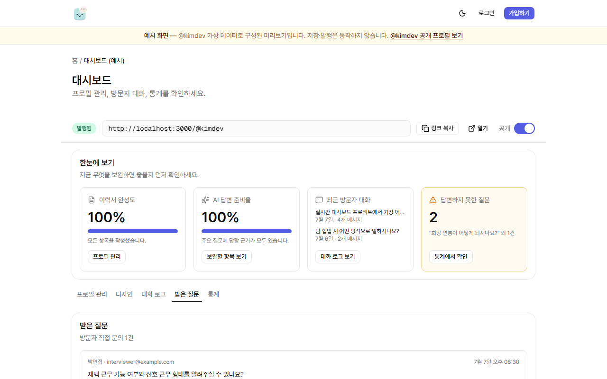

</td>
</tr>
</table>

예시 경로: [`/demo/onboarding`](https://my-ai-resume-alpha.vercel.app/demo/onboarding) · [`/demo/dashboard`](https://my-ai-resume-alpha.vercel.app/demo/dashboard) · [`/demo/dashboard/edit`](https://my-ai-resume-alpha.vercel.app/demo/dashboard/edit)

---

## 지금 할 수 있는 것

### 지원자(소유자) 입장

1. **회원가입 & 슬러그 설정** — `/@my-name` 형태의 고유 주소
2. **이력서 빌더** (`/dashboard/edit`) — 10개 섹션, 사이드바에서 순서 변경·섹션 on/off
   - 기본 정보, 경력, 학력, 자격·어학·수상, 경험/활동/교육, 기술 스택, 프로젝트, 포트폴리오, 자기소개서, 예상 질문 답변
   - **프로필 사진**: 드래그앤드롭 업로드 + 3:4 크롭 편집 (5MB 이하)
   - **포트폴리오**: 최대 8개 항목, 이미지(3MB)·PDF(8MB)·YouTube/Vimeo 링크
   - **기술 스택**: 태그 입력, 프로젝트별 기술 스택도 자유 입력
   - **외부 링크**: GitHub·블로그 등 이름+URL을 자유롭게 추가 (고정 필드 없음)
   - blur·30초 간격 **자동 저장**, **완성도** 카드, **PDF 가져오기**(Gemini 추출), **공개 화면 미리보기**
3. **발행** — 시스템 프롬프트 생성 후 `published` 상태로 전환
4. **대시보드** (`/dashboard`)
   - 링크 복사, 비공개 전환, PDF 다운로드
   - **대화 로그** — 방문자가 무엇을 물었는지 확인
   - **통계** — 조회수, 세션 수, 7일 추이, **답변하지 못한 질문**
   - **받은 질문** — AI가 답하지 못한 문의 이메일
   - **모의 면접** — 면접관 모드로 답변 연습
   - **챗봇이 답하기 어려운 영역** — 비어 있는 이력서 항목 때문에 못 하는 답변을 짚어 주고 해당 빌더 단계로 이동
   - 대화/통계에서 **FAQ 원클릭 저장**

### 면접관(방문자) 입장

1. `/@슬러그` 접속 — 로그인 없음
2. 히어로 → 이력서 본문 순으로 열람, 데스크톱은 우측 섹션 내비게이션으로 이동
3. 포트폴리오 섹션에서 이미지·PDF·영상 확인
4. 우하단 버튼으로 **AI 채팅 창** 열기 — 스트리밍 답변, 이력서에 근거가 있는 **추천 질문 3개**, 답변이 어려울 때 **직접 문의** 폼
   - 데스크톱에서는 좌상단 모서리 드래그로 창 크기 조절, 헤더 버튼으로 확대/축소
5. 카카오톡·X·링크 복사로 공유

### 예시 프로필 `@kimdev`

- 코드에 박아 둔 **가상 데이터**(김개발, 프론트엔드 3년차)
- DB·조회수·신고와 무관, 랜딩 **예시 보기** 전용
- 실제 사용자 이력서가 노출되지 않음

---

## AI 채팅은 어떻게 동작하나

- 이력서·FAQ·자기소개서 내용을 **템플릿으로 조합**한 시스템 프롬프트 사용 (매번 LLM으로 이력서 재작성하지 않음)
- **1인칭 존댓말**, 지원동기·STAR·경력기술 질문 유형별 답변 가이드
- 이력서에 없는 내용은 지어내지 않음 → 모를 때 정해진 문구 + **직접 문의** 유도
- 전화번호·정확한 생년은 채팅에서 비공개 (나이대만), 이력서 패널 표시는 소유자가 토글
- **FAQ 우선 응답** — 등록한 예상 질문은 키워드 + 임베딩 의미 매칭(유사도 0.72)으로 준비된 답변을 그대로 재서술
- **근거 있는 질문만 추천** — 발행 시 이력서를 훑어 "무엇에 답할 수 있는가"를 계산해 두고, 그 목록에서만 추천 질문을 만듭니다. 프로젝트 트러블슈팅이 비어 있으면 "가장 어려웠던 문제" 질문 자체가 나오지 않습니다
- **꼬리질문 검증** — 답변 후 생성되는 후속 질문도 같은 근거로 걸러내고, 통과하지 못하면 답변 가능한 질문으로 교체합니다. 직전 답변이 거절이면 후속 질문 생성을 건너뜁니다 (Gemini 호출 절약)
- **RAG(pgvector)** — 발행 시 이력서를 청크로 나눠 임베딩 색인(`gemini-embedding-001`, 768차원). 질문과 가까운 청크를 프롬프트 상단 focus 블록으로 재강조
  - 색인은 항상 돌지만 **검색 주입은 `RAG_RETRIEVAL_ENABLED` 플래그로 제어**(기본 off = 전체 컨텍스트 방식)
- **모델 폴백** — 기본 모델이 쿼터/404로 실패하면 `GEMINI_MODELS` 체인의 다음 모델로 재시도. 모델 직접 선택 UI는 소유자(모의 면접·미리보기) 전용
- Upstash Redis **레이트리밋** — 방문자 분당 5회·일 50회, 소유자 분당 10회·일 200회
- 질문 500자 제한, 히스토리는 최근 10턴까지만 전달
- 시스템 프롬프트 원문은 클라이언트에 노출하지 않음

인사말은 짧게 고정되어 있습니다.

> 안녕하세요, {이름}의 AI 챗봇입니다! 궁금하신 점이 있으시면 편하게 물어보세요.

---

## 기술 스택

Next.js 16 · React 19 · TypeScript · Tailwind v4 · shadcn/ui · Supabase (Auth, Postgres, pgvector, Storage, RLS) · Google Gemini · Upstash Redis · Vitest · Playwright · Vercel

---

## 로컬에서 실행하기

```bash
npm install
cp .env.local.example .env.local   # 키 입력
npm run db:push                    # 마이그레이션 적용
npm run dev
```

[https://my-ai-resume-alpha.vercel.app](https://my-ai-resume-alpha.vercel.app) — 예시는 [https://my-ai-resume-alpha.vercel.app/@kimdev](https://my-ai-resume-alpha.vercel.app/@kimdev)

### 자주 쓰는 명령

| 명령                           | 설명                       |
| ------------------------------ | -------------------------- |
| `npm run dev`                  | 개발 서버                  |
| `npm run build`                | 프로덕션 빌드              |
| `npm run test`                 | Vitest                     |
| `npm run test:e2e`             | Playwright smoke           |
| `npm run test:e2e:integration` | Playwright 통합 (발행→채팅) |
| `npm run test:e2e:screenshots` | README 스크린샷 갱신       |
| `npm run test:e2e:rag`         | RAG 골든 질문 회귀         |
| `npm run db:push`              | Supabase 마이그레이션      |
| `npm run db:types`             | `types/database.ts` 재생성 |

환경변수는 [`.env.local.example`](.env.local.example) 참고.  
프로덕션 출시 전: [`docs/10_프로덕션_체크리스트.md`](docs/10_프로덕션_체크리스트.md)

---

## DB 마이그레이션 (24개)

| #   | 파일                                                        | 요약                            |
| --- | ----------------------------------------------------------- | ------------------------------- |
| 1   | `20260705150000_initial_schema.sql`                         | 초기 스키마, RLS, auth 트리거   |
| 2   | `20260705160000_avatars_storage.sql`                        | 프로필 사진 Storage             |
| 3   | `20260705170000_profile_daily_stats.sql`                    | 일별 조회 통계                  |
| 4   | `20260705180000_admin_moderation.sql`                       | 관리자·모더레이션               |
| 5   | `20260705190000_reports_resolution.sql`                     | 신고 처리 상태                  |
| 6   | `20260705200000_resume_data_expansion.sql`                  | 경력·학력·연락처 등             |
| 7   | `20260705210000_profile_enabled_sections.sql`               | 섹션 on/off                     |
| 8   | `20260706000000_owner_faqs.sql`                             | 예상 질문 답변                  |
| 9   | `20260706120000_resume_sections_expansion.sql`              | 학력·자격·활동 분리             |
| 10  | `20260706130000_skills_sort_order.sql`                      | 기술 스택 정렬                  |
| 11  | `20260706140000_profile_section_order.sql`                  | 섹션 표시 순서                  |
| 12  | `20260707000000_korean_market_improvements.sql`             | PII 토글, 문의, 채팅 세션 타입  |
| 13  | `20260708000000_profile_links_replace_external_sources.sql` | 외부 링크 테이블, RSS 연동 제거 |
| 14  | `20260714100000_multi_profiles.sql`                         | 다중 프로필(3개), owner_id RLS  |
| 15  | `20260714110000_profile_label.sql`                          | 프로필 라벨                     |
| 16  | `20260715100000_mvp_security_hardening.sql`                 | RLS·RPC 보안 강화               |
| 17  | `20260911100000_drop_legacy_portfolios.sql`                 | 미사용 `portfolios` 잔재 제거   |
| 18  | `20260911110000_portfolio_items.sql`                        | 포트폴리오 항목                 |
| 19  | `20260911120000_portfolio_media_storage.sql`                | 포트폴리오 미디어 Storage       |
| 20  | `20260914100000_system_prompt_token_estimate.sql`           | 프롬프트 토큰 추정치 기록       |
| 21  | `20260914110000_rag_pgvector.sql`                           | pgvector 임베딩 색인·검색 RPC   |
| 22  | `20260914120000_drop_legacy_editor_documents.sql`           | 미사용 `editor_documents` 제거  |
| 23  | `20260914130000_projects_tech_stack_jsonb.sql`              | 프로젝트 기술 스택 jsonb 전환   |
| 24  | `20260918100000_chat_quality_metrics.sql`                   | 답변 성공 여부 계측, 답변 가능 질문 목록 |

상세: [`supabase/README.md`](supabase/README.md)

---

## 문서

| 문서                                                               | 내용                        |
| ------------------------------------------------------------------ | --------------------------- |
| [`docs/09_학습가이드.md`](docs/09_학습가이드.md)                   | A–Z 학습 (TS/Next 초보용)   |
| [`docs/02_기능명세서.md`](docs/02_기능명세서.md)                   | F-01~F-27 기능 상세         |
| [`docs/07_현황감사.md`](docs/07_현황감사.md)                       | 코드 vs 명세, backlog       |
| [`docs/08_개발일지.md`](docs/08_개발일지.md)                       | 세션별 작업 로그            |
| [`docs/04_아키텍처명세서.md`](docs/04_아키텍처명세서.md)           | DB·API·프롬프트 구조        |
| [`AGENTS.md`](AGENTS.md)                                           | 에이전트 역할               |
| [`CLAUDE.md`](CLAUDE.md)                                           | 작업 가이드라인·프로젝트 규칙 |

멀티 PC에서 이어할 때:

```bash
git pull
# 에이전트에게: docs/07_현황감사.md, docs/08_개발일지.md, README.md 를 읽고 이어서 작업
```

에이전트(문서·품질·PR): [`AGENTS.md`](AGENTS.md) · [`CLAUDE.md`](CLAUDE.md) §5

---

## 아직 손볼 부분

- RAG 검색 주입이 기본 off — 골든 질문 회귀(`test:e2e:rag`)로 임계값을 검증한 뒤 기본 on 검토
- `system_prompts.token_estimate` 는 기록만 하고 아직 읽는 곳이 없음
- 프로필 삭제는 API만 있고 대시보드 UI 미연결
- 답변 실패를 기록·집계하지만 알림이나 주간 리포트는 없음 — 소유자가 통계 탭을 직접 열어야 함
- Gemini 사용량·쿼터 모니터링, 방문 퍼널 분석 도구 미도입

전체 backlog: [`docs/07_현황감사.md`](docs/07_현황감사.md)

---

## 라이선스

개인 프로젝트. 상업 이용 시 별도 문의.
