<p align="center">
  
</p>

<h1 align="center">CloneCV</h1>

<p align="center">
  <b>이력서 PDF 하나 던지는 대신, 나와 대화할 수 있는 링크를 내보세요.</b><br/>
  이력서를 입력하면 그 내용만 근거로 답하는 <b>AI 클론</b>이 만들어지고,<br/>
  <code>/@슬러그</code> 주소 하나로 <b>웹 이력서 + 실시간 채팅</b>을 공유합니다.
</p>

<p align="center">
  <a href="https://www.jongwon.site/@kimdev"><b>▶ 라이브 데모 (@kimdev)</b></a> ·
  <a href="https://www.jongwon.site">서비스 홈</a> ·
  <a href="https://www.jongwon.site/demo/dashboard">대시보드 데모</a>
  <br/><br/>
  <a href="https://github.com/jongwon-kr/my-ai-resume/actions/workflows/ci.yml"></a>
</p>

> 데모는 로그인 없이 볼 수 있습니다. `@kimdev`는 코드에 넣어 둔 **가상의 프론트엔드 개발자 "김개발"** 이고, 실제 사용자 데이터는 노출되지 않습니다.

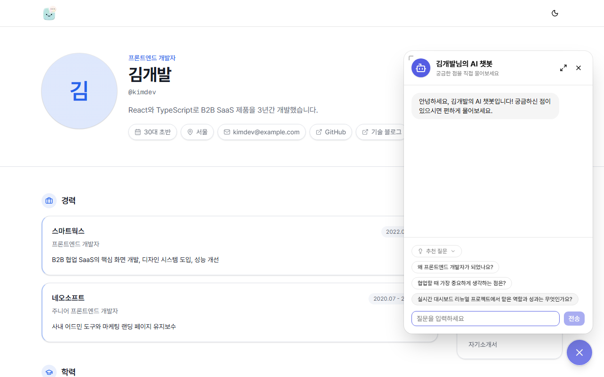

---

## 프로젝트 개요

|               |                                                                                                     |
| ------------- | --------------------------------------------------------------------------------------------------- |
| **기간**      | 2026.07 ~ 2026.09 (진행 중)                                                                         |
| **인원**      | 1인 개발 — 기획 · 설계 · 프론트엔드 · 백엔드 · DB · 배포                                            |
| **개발 방식** | 요구사항 → 기능 명세 → 아키텍처 문서를 먼저 쓰고, AI 페어 프로그래밍(Cursor → Claude Code)으로 구현 |
| **주요 기술** | Next.js 16 · React 19 · TypeScript · Supabase(Postgres, RLS, pgvector) · Gemini · Upstash Redis     |
| **규모**      | 기능 명세 F-01 ~ F-33 · DB 마이그레이션 26개 · 단위 테스트 213개 · Playwright E2E 4종               |
| **운영 비용** | Gemini · Upstash · Supabase 무료 티어 안에서 운영                                                   |

## 왜 만들었나

PDF 이력서는 끝까지 읽히기 어렵고, 웹 포트폴리오는 정적이라 **"이 사람한테 직접 물어보고 싶은 것"** 을 확인할 방법이 없습니다.
CloneCV는 이력서에 있는 사실만 근거로 **1인칭으로 답하는 AI**를 붙여, 면접관의 경험을 **읽기 → 대화**로 바꾸는 실험입니다.
핵심 과제는 "그럴듯하게 말하는 챗봇"이 아니라 **이력서에 없는 말을 지어내지 않는 챗봇**을 만드는 것이었습니다.

---

## 핵심 기능

**면접관(방문자)** — 로그인 없이 `/@슬러그`

- 웹 이력서 열람(데스크톱 섹션 내비게이션, 모바일 대응) + 포트폴리오 이미지 · PDF · 영상
- **AI 채팅** — 스트리밍 답변, 이력서에 근거가 있는 **추천 질문 3개**, 답하기 어려우면 **직접 문의** 폼
- 카카오톡 · X · 링크 공유

**지원자(소유자)**

- **이력서 빌더** — 10개 섹션 순서 변경·on/off, 자동 저장, **PDF 가져오기(Gemini 추출)** · PDF 내보내기
- **발행** — 시스템 프롬프트 조립, 답변 가능 질문 계산, RAG 색인을 한 번에
- **대시보드** — 대화 로그, 조회 통계, **답변하지 못한 질문**, 모의 면접, AI 사용량 게이지
- **디자인 커스텀** — 테마 프리셋 5종, 색상 · 글꼴 · 카드 스타일, 실제 공개 화면으로 실시간 미리보기
- 계정당 프로필 최대 3개, 관리자 신고 · 모더레이션

<details>
<summary><b>기능 상세 보기</b></summary>

### 지원자(소유자) 입장

1. **회원가입 & 슬러그 설정** — `/@my-name` 형태의 고유 주소
2. **이력서 빌더** (`/dashboard/edit`) — 10개 섹션, 사이드바에서 순서 변경·섹션 on/off
   - 기본 정보, 경력, 학력, 자격·어학·수상, 경험/활동/교육, 기술 스택, 프로젝트, 포트폴리오, 자기소개서, 예상 질문 답변
   - **프로필 사진**: 드래그앤드롭 업로드 + 3:4 크롭 편집 (5MB 이하)
   - **포트폴리오**: 최대 8개 항목, 이미지(3MB)·PDF(8MB)·YouTube/Vimeo 링크
   - **기술 스택**: 태그 입력, 프로젝트별 기술 스택도 자유 입력
   - **외부 링크**: GitHub·블로그 등 이름+URL을 자유롭게 추가 (고정 필드 없음)
   - blur·30초 간격 **자동 저장**, **완성도** 카드, **PDF 가져오기**(Gemini 추출), **공개 화면 미리보기**
3. **발행** — 시스템 프롬프트 생성 후 `published` 상태로 전환
4. **대시보드** (`/dashboard`)
   - 상단 고정 바 — 공개 주소, 링크 복사, 공개/비공개 토글
   - **한눈에 보기** — 완성도 %, AI 답변 준비율, 최근 대화 3건, 답변 실패 알림
   - **디자인** — 공개 프로필 테마 편집 (아래 참고)
   - **대화 로그** — 방문자가 무엇을 물었는지 확인
   - **통계** — 조회수, 세션 수, 7일 추이, **답변하지 못한 질문**
   - **받은 질문** — AI가 답하지 못한 문의 이메일
   - **모의 면접** — 면접관 모드로 답변 연습
   - **챗봇이 답하기 어려운 영역** — 비어 있는 이력서 항목 때문에 못 하는 답변을 짚어 주고 해당 빌더 단계로 이동
   - **AI 사용량** — 오늘 Gemini 호출 수, 최근 30일 토큰, 남은 한도 게이지
   - 대화/통계에서 **FAQ 원클릭 저장**
   - **프로필 삭제** — 슬러그를 다시 입력해야 실행, 업로드한 파일까지 정리
5. **디자인 커스텀** (`/dashboard` 디자인 탭)
   - 테마 프리셋 5종(모던 슬레이트 · 다크 디벨로퍼 · 웜 미니멀 · 크리에이티브 볼드 · 이그제큐티브 클래식)
   - 포인트 색상, 글꼴 3종, 프로필 사진 모양, 카드 스타일, 헤더 여백
   - **전체 화면 편집** — 실제 공개 화면을 그대로 띄운 채 수정, 데스크톱/모바일 토글
   - 바꾸는 즉시 미리보기에 반영(서버 요청 없음), 저장해야 방문자에게 적용

### 면접관(방문자) 입장

1. `/@슬러그` 접속 — 로그인 없음
2. 히어로 → 이력서 본문 순으로 열람, 데스크톱은 우측 섹션 내비게이션으로 이동
3. 포트폴리오 섹션에서 이미지·PDF·영상 확인
4. 우하단 버튼으로 **AI 채팅 창** 열기 — 스트리밍 답변, 이력서에 근거가 있는 **추천 질문 3개**, 답변이 어려울 때 **직접 문의** 폼
   - 데스크톱에서는 좌상단 모서리 드래그로 창 크기 조절, 헤더 버튼으로 확대/축소
5. 카카오톡·X·링크 복사로 공유

### 예시 프로필 `@kimdev`

- 코드에 박아 둔 **가상 데이터**(김개발, 프론트엔드 3년차)
- DB·조회수·신고와 무관, 랜딩 **예시 보기** 전용
- 실제 사용자 이력서가 노출되지 않음

</details>

---

## 아키텍처

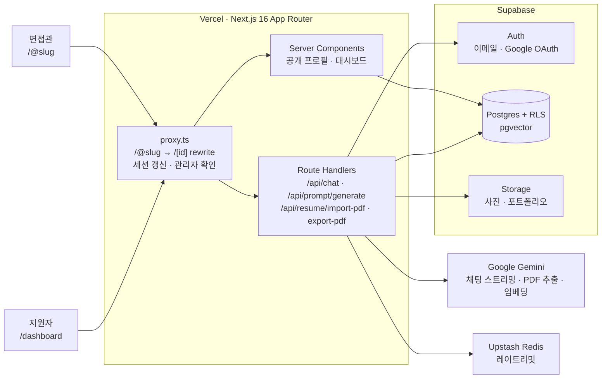
```mermaid
flowchart LR
  V["면접관<br/>/@slug"] --> PX
  O["지원자<br/>/dashboard"] --> PX

  subgraph VC["Vercel · Next.js 16 App Router"]
    PX["proxy.ts<br/>/@slug → /[id] rewrite<br/>세션 갱신 · 관리자 확인"]
    RSC["Server Components<br/>공개 프로필 · 대시보드"]
    API["Route Handlers<br/>/api/chat · /api/prompt/generate<br/>/api/resume/import-pdf · export-pdf"]
  end

  PX --> RSC
  PX --> API

  subgraph SB["Supabase"]
    AUTH["Auth<br/>이메일 · Google OAuth"]
    DB[("Postgres + RLS<br/>pgvector")]
    ST["Storage<br/>사진 · 포트폴리오"]
  end

  RSC --> DB
  API --> AUTH
  API --> DB
  API --> ST
  API --> GM["Google Gemini<br/>채팅 스트리밍 · PDF 추출 · 임베딩"]
  API --> RD["Upstash Redis<br/>레이트리밋"]
```

**발행 시점에 무거운 일을 끝내 둡니다.** 소유자가 발행하면 `/api/prompt/generate`가 한 번에 처리합니다.

1. 이력서 · FAQ · 자기소개서를 **템플릿으로 조합**해 시스템 프롬프트를 만듭니다. LLM이 이력서를 다시 쓰지 않습니다.
2. 이력서로 **답할 수 있는 질문 목록(coverage)** 을 계산해 `system_prompts.coverage`(jsonb)에 저장합니다.
3. 이력서를 청크로 나눠 `gemini-embedding-001`(768차원)로 **pgvector 색인**을 만듭니다.

덕분에 채팅 요청 경로에서는 추가 계산이나 DB 조회 없이 저장된 결과만 읽습니다.

### 채팅 한 턴의 흐름 (`lib/chat/handle-chat-request.ts`)

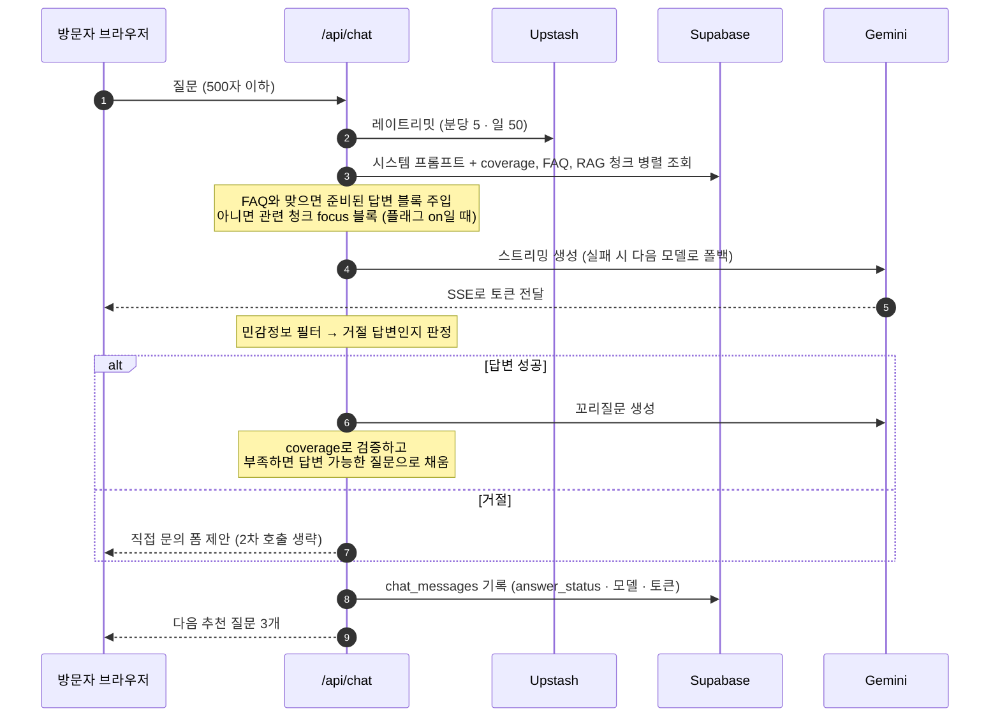
```mermaid
sequenceDiagram
  autonumber
  participant B as 방문자 브라우저
  participant C as /api/chat
  participant R as Upstash
  participant D as Supabase
  participant G as Gemini

  B->>C: 질문 (500자 이하)
  C->>R: 레이트리밋 (분당 5 · 일 50)
  C->>D: 시스템 프롬프트 + coverage, FAQ, RAG 청크 병렬 조회
  Note over C: FAQ와 맞으면 준비된 답변 블록 주입<br/>아니면 관련 청크 focus 블록 (플래그 on일 때)
  C->>G: 스트리밍 생성 (실패 시 다음 모델로 폴백)
  G-->>B: SSE로 토큰 전달
  Note over C: 민감정보 필터 → 거절 답변인지 판정
  alt 답변 성공
    C->>G: 꼬리질문 생성
    Note over C: coverage로 검증하고<br/>부족하면 답변 가능한 질문으로 채움
  else 거절
    C-->>B: 직접 문의 폼 제안 (2차 호출 생략)
  end
  C->>D: chat_messages 기록 (answer_status · 모델 · 토큰)
  C-->>B: 다음 추천 질문 3개
```

<details>
<summary><b>AI 채팅 세부 규칙</b></summary>

- **1인칭 존댓말**, 지원동기·STAR·경력기술 질문 유형별 답변 가이드
- 이력서에 없는 내용은 지어내지 않음 → 모를 때 정해진 문구 + **직접 문의** 유도
- 전화번호·정확한 생년은 채팅에서 비공개 (나이대만), 이력서 패널 표시는 소유자가 토글
- **FAQ 우선 응답** — 등록한 예상 질문은 키워드 + 임베딩 의미 매칭(유사도 0.72)으로 준비된 답변을 그대로 재서술
- **근거 있는 질문만 추천** — 프로젝트 트러블슈팅이 비어 있으면 "가장 어려웠던 문제" 질문 자체가 나오지 않음
- **RAG 검색 주입은 `RAG_RETRIEVAL_ENABLED` 플래그로 제어** (기본 off = 전체 컨텍스트 방식, 색인은 항상 수행)
- **모델 폴백** — 기본 모델이 쿼터/404로 실패하면 `GEMINI_MODELS` 체인의 다음 모델로 재시도
- 레이트리밋 — 방문자 분당 5회·일 50회, 소유자 분당 10회·일 200회
- 질문 500자 제한, 히스토리는 최근 10턴까지만 전달
- 시스템 프롬프트 원문은 클라이언트에 노출하지 않고, 프롬프트 인젝션·역할 탈출 요청에 응하지 않음

인사말은 짧게 고정되어 있습니다.

> 안녕하세요, {이름}의 AI 챗봇입니다! 궁금하신 점이 있으시면 편하게 물어보세요.

</details>

---

## 기술 선택 이유

| 선택                                | 이유                                                                                                      | 대안                                  |
| ----------------------------------- | --------------------------------------------------------------------------------------------------------- | ------------------------------------- |
| **Supabase**                        | Auth · Postgres · Storage · RLS · pgvector를 한 서비스로 해결, 1인 개발에서 백엔드 서버 운영 부담 제거    | 별도 API 서버 + ORM                   |
| **전체 컨텍스트 프롬프트 (기본값)** | 한 사람의 이력서는 분량이 작아 통째로 넣는 쪽이 더 단순하고 정확함. 벡터 색인은 미리 쌓고 주입만 플래그로 | 처음부터 벡터 검색 RAG                |
| **템플릿 조합 시스템 프롬프트**     | 발행 시 한 번만 조립, LLM이 이력서를 재작성하지 않아 환각 여지와 비용이 줄어듦                            | LLM으로 페르소나 요약 생성            |
| **규칙 기반 coverage 엔진**         | 결정론적이라 단위 테스트가 가능하고 API 쿼터를 쓰지 않음                                                  | 임베딩 유사도로 답변 가능성 판정      |
| **Upstash Redis**                   | 서버리스 인스턴스 사이에 공유되는 카운터가 필요                                                           | 인메모리 카운터 (인스턴스마다 초기화) |
| **Gemini**                          | 채팅 · PDF 추출 · 임베딩을 SDK 하나로, 무료 티어 안에서 운영 가능                                         | —                                     |

---

## 기술적 도전 & 트러블슈팅

### 1. 추천 질문을 눌렀는데 AI가 "답하기 어렵다"고 답하는 문제

- **문제** — 방문자가 추천 질문을 누르면 클론이 거절하는 일이 반복됐고, 꼬리질문도 점점 이력서 밖으로 벗어났습니다.
- **원인**
  - 기본 추천 질문("가장 어려웠던 프로젝트는?")이 **데이터 유무와 상관없이** 항상 노출됐습니다.
  - 꼬리질문은 직전 답변만 보고 LLM이 만들었습니다. "이력서로 답할 수 있어야 한다"는 문구가 프롬프트에만 있고 **검증하는 코드는 없었습니다**.
  - 답변 성공 여부를 저장하지 않아 실패를 집계할 수도 없었습니다.
- **해결**
  - `lib/chat/question-coverage.ts` — 근거 필드가 채워진 질문만 만드는 **결정론적 coverage 엔진**. 발행 시 계산해 저장하므로 채팅 경로의 추가 DB 조회는 0회입니다.
  - `lib/chat/follow-up.ts` — LLM이 만든 꼬리질문을 같은 기준으로 걸러내고, 부족한 수는 답변 가능한 질문으로 채웁니다. 직전 답변이 거절이면 **Gemini 2차 호출 자체를 건너뜁니다**.
  - `chat_messages`에 `answer_status` 등을 기록해 대시보드에 **답변하지 못한 질문** 카드를 만들었습니다.
- **결과** — 근거 없는 질문이 추천 목록에 나오지 않게 됐고, 소유자는 실패한 질문을 보고 바로 FAQ로 보완할 수 있게 됐습니다.

### 2. 화면에는 없는데 전화번호·생년이 새어 나가던 문제

- **문제** — 소유자가 "전화번호 비공개"로 설정해도 공개 프로필의 **RSC 페이로드**(클라이언트로 직렬화되는 데이터)에 전화번호와 생년이 들어 있었습니다. 화면에는 보이지 않지만 페이지 소스로 확인할 수 있는 상태였습니다.
- **해결** — `lib/public-profile/sanitize-public-profile.ts`에서 서버 단계에서 필드를 지웁니다. 생년은 아예 빼고 나이대 라벨만 내보내며, 전화번호는 공개 설정일 때만 포함합니다.
- **함께 고친 것**
  - OG 이미지가 한 번도 생성되지 않던 버그(폰트 CDN 404 + Satori 규칙 위반 3곳)
  - Vitest 설정이 `lib/` 아래 테스트 4개를 실행하지 않던 문제
- **결과** — 단위 테스트 29개 → 102개. 이후 RLS insert 제한, RPC 권한 회수, 오픈 리다이렉트 차단(`lib/auth/safe-redirect.ts`) 등 보안 점검을 이어서 진행했습니다.

### 3. 대화가 길어지면 "일일 한도 초과"로 잘못 안내되던 문제

- **문제** — 긴 대화에서 컨텍스트가 모델 한도를 넘었는데, 사용자에게는 **"오늘 사용량을 초과했다"** 는 엉뚱한 메시지가 나갔습니다.
- **원인** — 요청 전에 토큰 예산을 확인하는 단계가 없어, 초과 에러가 쿼터 에러로 분류됐습니다.
- **해결** — `lib/chat/token-budget.ts`
  - 요청마다 `countTokens`를 부르면 왕복 시간과 무료 쿼터를 쓰므로, **문자 수 기반으로 보수적으로 추정**합니다(한국어 기준 ÷1.5, 과대 추정 쪽으로).
  - 히스토리는 오래된 것부터 **user/model 쌍 단위로** 잘라, Gemini가 요구하는 "user 턴으로 시작" 규칙이 깨지지 않게 했습니다.

### 4. 하위 컴포넌트를 고치지 않고 테마 시스템 붙이기

- **과제** — 공개 프로필 하위 컴포넌트를 하나하나 고치지 않고 색 · 글꼴 · 카드 스타일을 바꿀 수 있어야 했습니다.
- **해결**
  - `lib/theme/css-vars.ts`가 `globals.css`와 **같은 토큰 이름**을 덮어씁니다. 주입 지점은 `public-profile-body.tsx` **한 곳**이라 공개 페이지 · 빌더 미리보기 · 디자인 편집기가 함께 적용됩니다.
  - 포인트 색 위 글자색은 **WCAG 상대 휘도**로 계산해 대비를 보장합니다.
- **작업 중 발견한 버그**
  - `--font-sans: var(--font-sans)` **자기 참조** 때문에 지정한 글꼴이 처음부터 적용된 적이 없었습니다. 한글 글리프가 있는 Pretendard로 교체했습니다.
  - 모바일 미리보기에서 컨테이너만 좁혀도 Tailwind `lg:`는 **실제 뷰포트** 기준으로 걸려 레이아웃이 깨졌습니다. `narrow` prop으로 해결했습니다.

---

## 품질 · 자동화

- **단위 테스트** — Vitest 213개 / 35개 파일 (`tests/` 도메인별 + `lib/` 인접 테스트)
- **E2E** — Playwright 4종: smoke · 통합(발행 → 채팅) · RAG 골든 질문 회귀 · README 스크린샷
- **CI** — GitHub Actions에서 단위 테스트 · 빌드 · E2E 실행. main에 push하면 이 README의 스크린샷을 **자동으로 다시 찍어 커밋**합니다.
- **보안** — Supabase RLS, 공개 응답 PII 제거, API별 레이트리밋, 관리자 경로 권한 확인, 시스템 프롬프트 비노출
- **문서 주도 개발** — 요구사항 · 기능 명세 · 아키텍처 문서를 먼저 쓰고, 작업마다 개발일지와 명세 대비 현황 감사를 갱신합니다 ([`docs/`](docs/))
- **AI 협업 규칙** — [`CLAUDE.md`](CLAUDE.md)에 작업 원칙을, `.claude/skills`에 문서 · 품질 점검 · PR 작성 역할을 분리해 두고 사용합니다

---

## 화면

### 랜딩

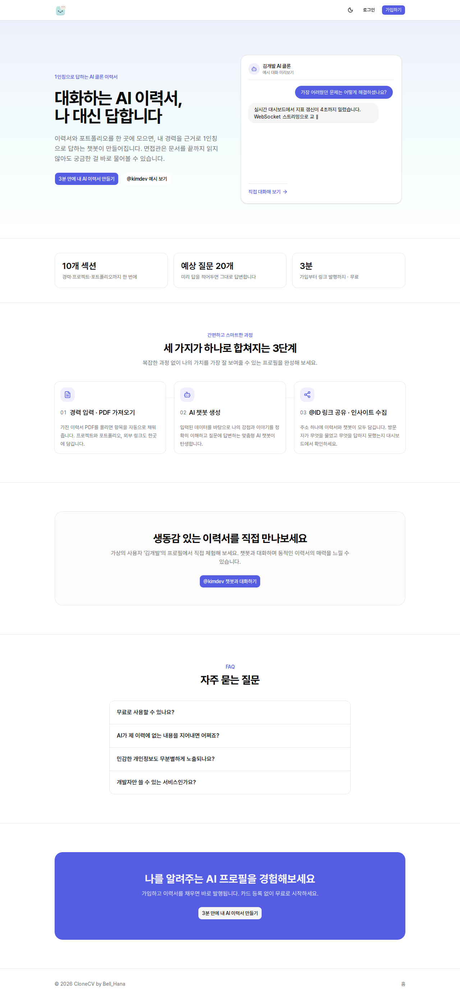

### 공개 프로필 — 이력서 + AI 채팅

데스크톱은 상단 히어로 + 이력서 본문 구조에 우측 섹션 내비게이션이 붙고, 채팅은 우하단 플로팅 버튼으로 엽니다.

<table>
<tr>
<td width="50%">

**데스크톱** (`/@kimdev`)

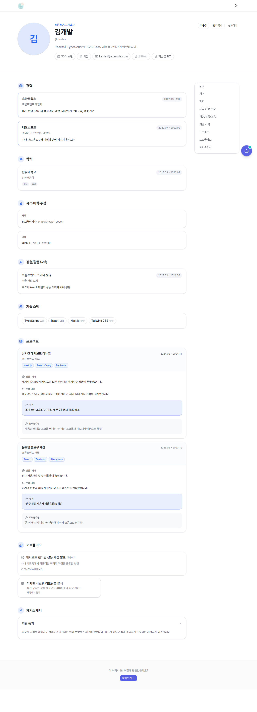

</td>
<td width="50%">

**모바일**

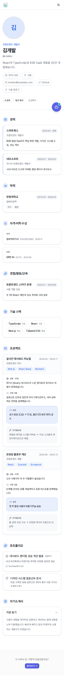

</td>
</tr>
</table>

### 이력서 빌더

10개 섹션 순서 변경 · on/off, 자동 저장, 완성도 카드, PDF 가져오기, 공개 화면 미리보기.

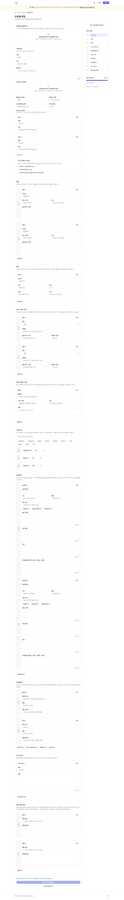

### 대시보드

공개 주소 · 링크 복사 · 공개 토글은 상단에 고정되고, **한눈에 보기** 위젯이 완성도 · AI 답변 준비율 · 최근 대화 · 답변하지 못한 질문을 보여 줍니다.

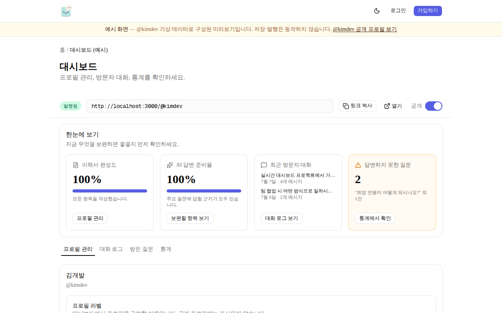

### 공개 프로필 디자인

프리셋 · 색 · 글꼴 · 사진 모양 · 카드 스타일을 고르면 **실제 공개 화면**으로 된 미리보기에 즉시 반영됩니다.

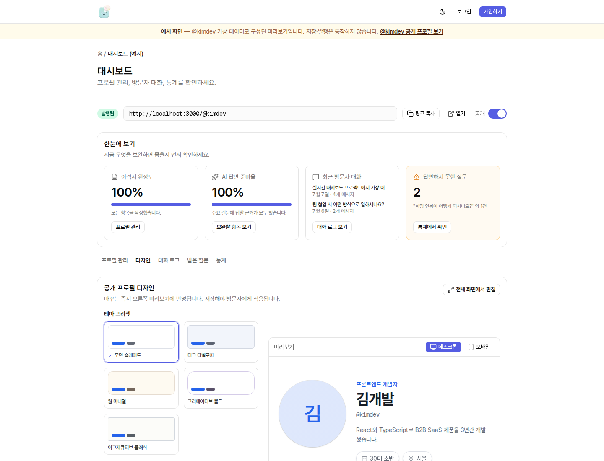

<details>
<summary><b>화면 더 보기 — 대화 로그 · 통계 · 받은 질문 · 가입 · 온보딩</b></summary>

<table>
<tr>
<td width="33%">

**대화 로그**

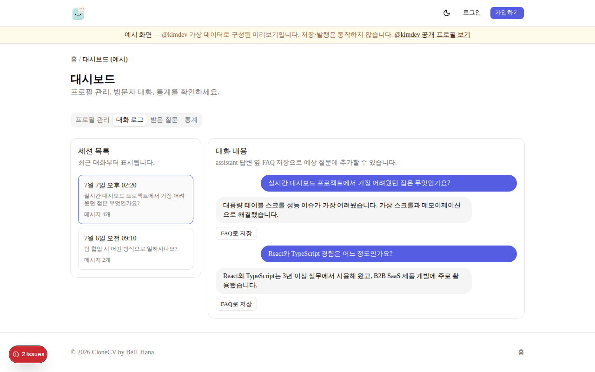

</td>
<td width="33%">

**통계**

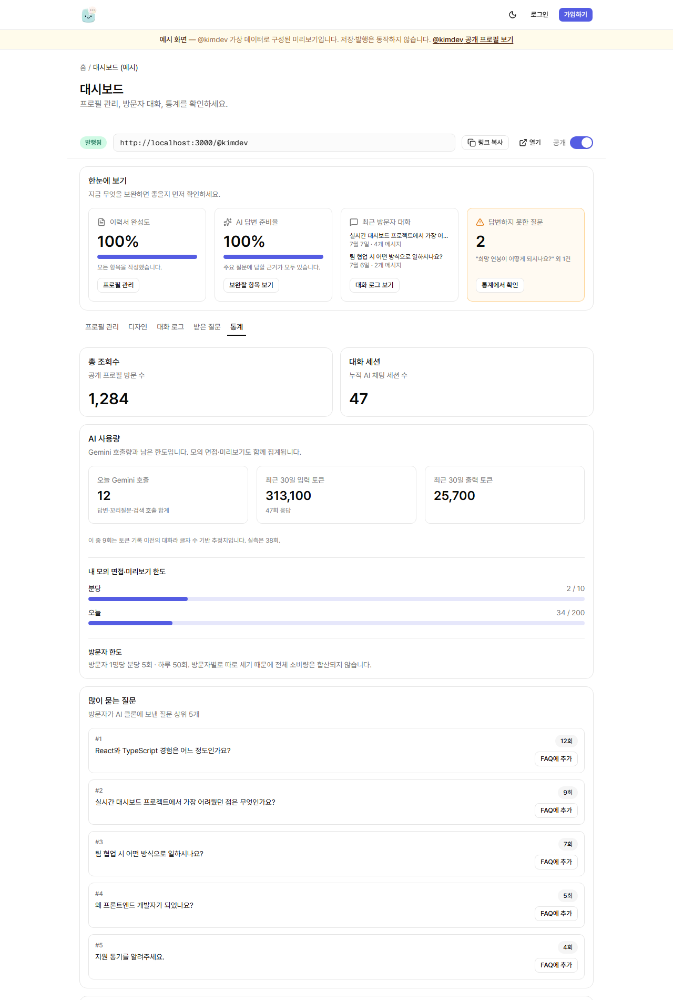

</td>
<td width="33%">

**받은 질문**

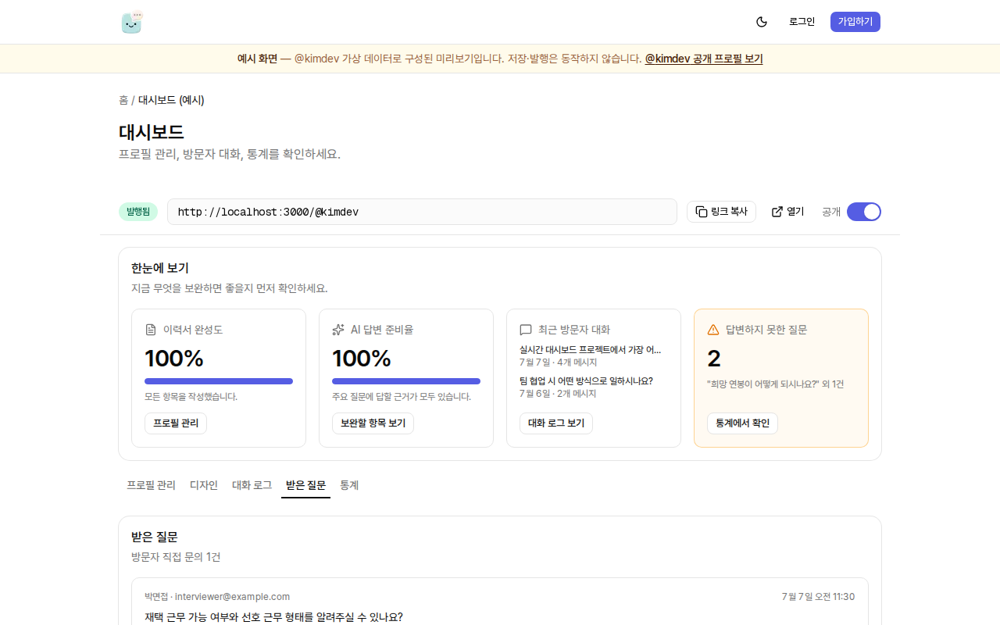

</td>
</tr>
</table>

<table>
<tr>
<td width="33%">

**회원가입** (이메일 · Google OAuth)

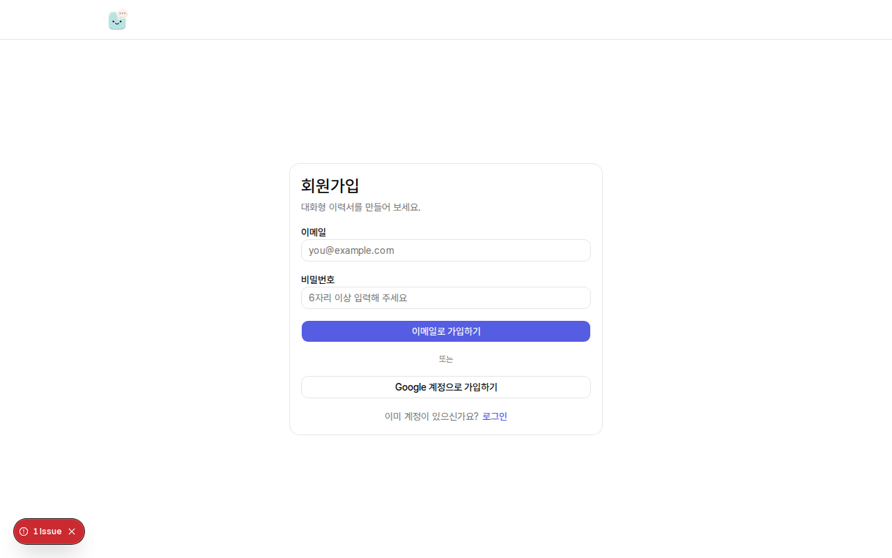

</td>
<td width="33%">

**로그인**

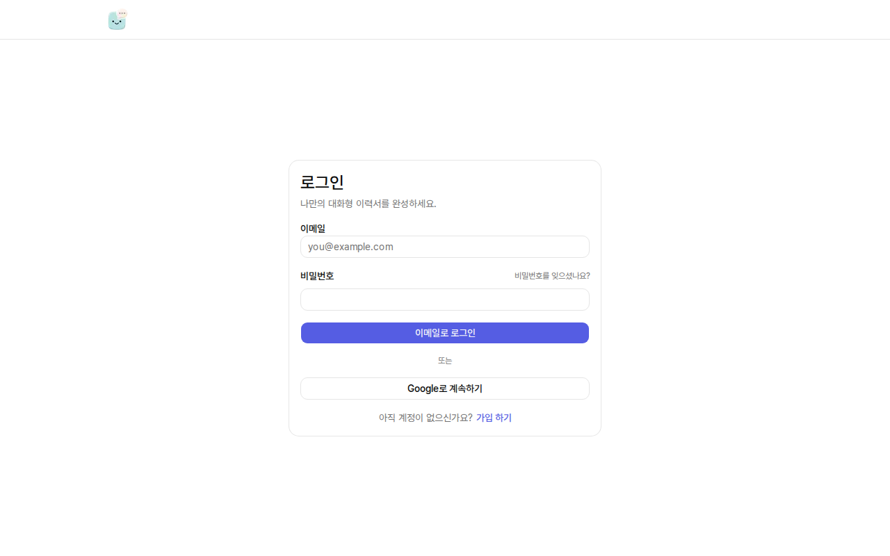

</td>
<td width="33%">

**온보딩** (슬러그 설정)

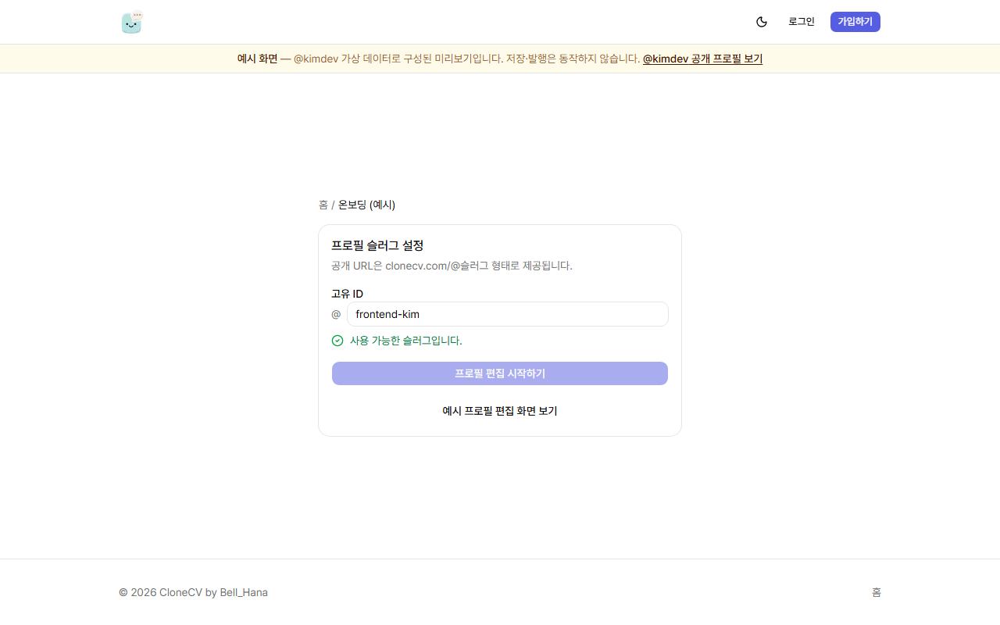

</td>
</tr>
</table>

</details>

로그인 없이 보는 예시 경로: [`/demo/onboarding`](https://www.jongwon.site/demo/onboarding) · [`/demo/dashboard`](https://www.jongwon.site/demo/dashboard) · [`/demo/dashboard/edit`](https://www.jongwon.site/demo/dashboard/edit)

---

## 회고 & 한계

**배운 점**

- 프롬프트에 "이력서 안에서만 답하라"고 쓰는 것과 **코드로 검증하는 것은 다릅니다.** 추천 질문 문제는 결정론적 검증을 추가하고 나서야 해결됐습니다.
- **측정하지 않으면 개선할 수 없습니다.** 답변 성공 여부를 기록하기 전에는 무엇이 실패하는지조차 알 수 없었습니다.
- 화면에 보이지 않는다고 안전한 것이 아닙니다. 서버에서 클라이언트로 넘기는 데이터 자체를 줄여야 합니다.

**아직 손볼 부분**

- RAG 검색 주입이 기본 off — 골든 질문 회귀(`test:e2e:rag`)로 임계값을 검증한 뒤 기본 on 검토
- OG 이미지가 색상 하드코딩이라 **디자인 테마가 반영되지 않음**, 한글 폰트도 CDN 의존
- 답변 실패를 기록·집계하지만 알림이나 주간 리포트는 없음 — 소유자가 통계 탭을 직접 열어야 함
- 방문자 레이트리밋은 IP별 키라 프로필 단위 소비량을 합산할 수 없음 (정책 문구로만 표시)
- 방문 퍼널 분석 도구(PostHog 등) 미도입

전체 backlog: [`docs/07_현황감사.md`](docs/07_현황감사.md)

---

## 로컬에서 실행하기

```bash
npm install
cp .env.local.example .env.local   # 키 입력
npm run db:push                    # 마이그레이션 적용
npm run dev
```

환경변수는 [`.env.local.example`](.env.local.example) 참고.
프로덕션 출시 전: [`docs/10_프로덕션_체크리스트.md`](docs/10_프로덕션_체크리스트.md)

| 명령                           | 설명                        |
| ------------------------------ | --------------------------- |
| `npm run dev`                  | 개발 서버                   |
| `npm run build`                | 프로덕션 빌드               |
| `npm run test`                 | Vitest                      |
| `npm run test:e2e`             | Playwright smoke            |
| `npm run test:e2e:integration` | Playwright 통합 (발행→채팅) |
| `npm run test:e2e:screenshots` | README 스크린샷 갱신        |
| `npm run test:e2e:rag`         | RAG 골든 질문 회귀          |
| `npm run db:push`              | Supabase 마이그레이션       |
| `npm run db:types`             | `types/database.ts` 재생성  |

<details>
<summary><b>DB 마이그레이션 (26개)</b></summary>

| #   | 파일                                                        | 요약                                     |
| --- | ----------------------------------------------------------- | ---------------------------------------- |
| 1   | `20260705150000_initial_schema.sql`                         | 초기 스키마, RLS, auth 트리거            |
| 2   | `20260705160000_avatars_storage.sql`                        | 프로필 사진 Storage                      |
| 3   | `20260705170000_profile_daily_stats.sql`                    | 일별 조회 통계                           |
| 4   | `20260705180000_admin_moderation.sql`                       | 관리자·모더레이션                        |
| 5   | `20260705190000_reports_resolution.sql`                     | 신고 처리 상태                           |
| 6   | `20260705200000_resume_data_expansion.sql`                  | 경력·학력·연락처 등                      |
| 7   | `20260705210000_profile_enabled_sections.sql`               | 섹션 on/off                              |
| 8   | `20260706000000_owner_faqs.sql`                             | 예상 질문 답변                           |
| 9   | `20260706120000_resume_sections_expansion.sql`              | 학력·자격·활동 분리                      |
| 10  | `20260706130000_skills_sort_order.sql`                      | 기술 스택 정렬                           |
| 11  | `20260706140000_profile_section_order.sql`                  | 섹션 표시 순서                           |
| 12  | `20260707000000_korean_market_improvements.sql`             | PII 토글, 문의, 채팅 세션 타입           |
| 13  | `20260708000000_profile_links_replace_external_sources.sql` | 외부 링크 테이블, RSS 연동 제거          |
| 14  | `20260714100000_multi_profiles.sql`                         | 다중 프로필(3개), owner_id RLS           |
| 15  | `20260714110000_profile_label.sql`                          | 프로필 라벨                              |
| 16  | `20260715100000_mvp_security_hardening.sql`                 | RLS·RPC 보안 강화                        |
| 17  | `20260911100000_drop_legacy_portfolios.sql`                 | 미사용 `portfolios` 잔재 제거            |
| 18  | `20260911110000_portfolio_items.sql`                        | 포트폴리오 항목                          |
| 19  | `20260911120000_portfolio_media_storage.sql`                | 포트폴리오 미디어 Storage                |
| 20  | `20260914100000_system_prompt_token_estimate.sql`           | 프롬프트 토큰 추정치 기록                |
| 21  | `20260914110000_rag_pgvector.sql`                           | pgvector 임베딩 색인·검색 RPC            |
| 22  | `20260914120000_drop_legacy_editor_documents.sql`           | 미사용 `editor_documents` 제거           |
| 23  | `20260914130000_projects_tech_stack_jsonb.sql`              | 프로젝트 기술 스택 jsonb 전환            |
| 24  | `20260918100000_chat_quality_metrics.sql`                   | 답변 성공 여부 계측, 답변 가능 질문 목록 |
| 25  | `20260919100000_chat_token_usage.sql`                       | Gemini 실측 토큰 기록                    |
| 26  | `20260920100000_profile_theme_config.sql`                   | 공개 프로필 디자인 설정                  |

상세: [`supabase/README.md`](supabase/README.md)

</details>

---

## 문서

| 문서                                                     | 내용                            |
| -------------------------------------------------------- | ------------------------------- |
| [`docs/01_요구사항명세서.md`](docs/01_요구사항명세서.md) | 문제 정의, 사용자, 요구사항     |
| [`docs/02_기능명세서.md`](docs/02_기능명세서.md)         | F-01~F-33 기능 상세             |
| [`docs/04_아키텍처명세서.md`](docs/04_아키텍처명세서.md) | DB·API·프롬프트 구조            |
| [`docs/07_현황감사.md`](docs/07_현황감사.md)             | 코드 vs 명세, backlog           |
| [`docs/08_개발일지.md`](docs/08_개발일지.md)             | 세션별 작업 로그                |
| [`docs/09_학습가이드.md`](docs/09_학습가이드.md)         | A–Z 학습 (TS/Next 초보용)       |
| [`AGENTS.md`](AGENTS.md) · [`CLAUDE.md`](CLAUDE.md)      | 에이전트 역할 · 작업 가이드라인 |

---

## 라이선스

개인 프로젝트. 상업 이용 시 별도 문의.
