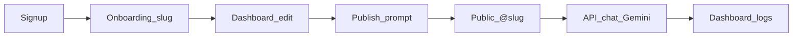
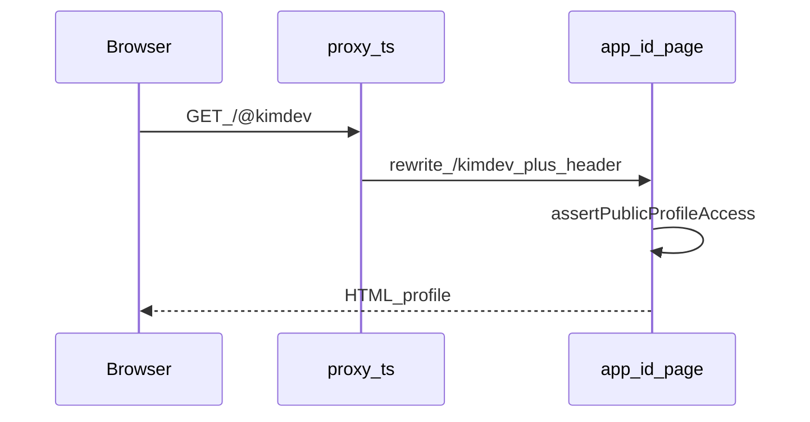
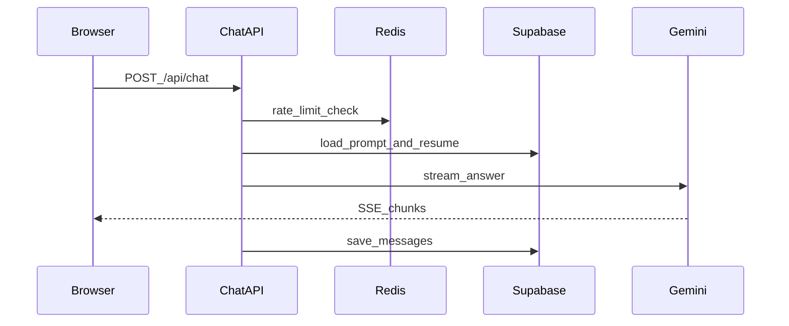

# CloneCV A–Z 학습 가이드

버전: v1.0 | 작성일: 2026-07-09

TypeScript / Next.js를 잘 몰라도, **이 레포만 따라가며** CloneCV를 이해하고 기능을 추가할 수 있게 하는 단계형 가이드입니다.  
명세·감사용 문서는 `docs/01`~`08`이고, **이 파일은 학습 순서**입니다.

에이전트에게 물을 때:

```
@docs/09_학습가이드.md
Phase N 기준으로, 파일 A→B→C만 따라가며 12살도 이해하게 설명해줘. 왜 이 기술인지 한 줄씩.
```

---

## 목표 (성공 기준)

끝나면 아래를 **코드 경로로** 말할 수 있어야 한다.

1. `/signup` → `/onboarding` → `/dashboard/edit` → 발행 → `/@slug` → 채팅 → `/dashboard` 때 **어느 파일이 순서대로** 도는지
2. Supabase / Gemini / Upstash / 카카오가 **어디서 키가 들어가고 누가 호출**하는지
3. “왜 이 기술인가”를 **다른 선택지와 비교해 한 문장**으로
4. 새 API + 화면 1개를 추가할 때 **어느 폴더에 무엇을** 두면 되는지

---

## 머릿속 지도 (먼저 이것만)

| 비유             | 폴더                   | 역할                            |
| ---------------- | ---------------------- | ------------------------------- |
| 메뉴판·좌석(URL) | `app/`                 | 주소마다 어떤 화면/API인지      |
| 주방 레시피      | `lib/`                 | 로그인, DB, AI, 레이트리밋 로직 |
| 접시·인테리어    | `components/`          | 버튼, 폼, 채팅창 UI             |
| 냉장고 설계도    | `supabase/migrations/` | 테이블·권한(RLS)                |
| 설명서           | `docs/`, `README.md`   | 왜 만들었는지, 뭐가 됐는지      |

**한 줄 제품:** 이력서를 채우면 → AI 클론이 생기고 → `/@내주소`로 공유하면 → 면접관이 채팅으로 물어본다.



---

## 왜 이 스택인가

출처: [`docs/05_기술스택_서비스정리.md`](05_기술스택_서비스정리.md), [`docs/04_아키텍처명세서.md`](04_아키텍처명세서.md)

| 선택                      | 다른 선택지          | 이 프로젝트에서 고른 이유                                     |
| ------------------------- | -------------------- | ------------------------------------------------------------- |
| **Next.js**               | CRA, Vite SPA        | `/@slug`는 SEO·공유(OG)가 중요 → 서버에서 HTML. Vercel 궁합.  |
| **TypeScript**            | 순수 JS              | 이력서 폼·DB 타입이 복잡. Cursor가 TS를 잘 다룸.              |
| **Supabase 한 방**        | Firebase + 별도 DB   | Auth + DB + Storage + RLS. 1인·1달 MVP.                       |
| **Gemini**                | Claude, OpenAI       | 무료 티어. 채팅·PDF 추출 같은 키.                             |
| **Full-context 프롬프트** | 벡터 DB(RAG)         | 이력서가 짧음 → “전부 알려주고 없는 말 금지”가 단순.          |
| **Upstash Redis**         | DB 로그, 메모리만    | Vercel 서버가 매번 새로 뜸 → **공유 카운터**. 도배·비용 방어. |
| **카카오 JS SDK**         | 서버 공유 API        | 브라우저에서 카톡 카드만 필요.                                |
| **proxy.ts** (Next 16)    | 예전 `middleware.ts` | `/@slug` 재작성 + 세션 갱신 + `/admin` 가드.                  |

문서에만 있고 코드에 없는 것: Sentry, PostHog → “아직 안 붙임”.

---

## 학습 방식 (매 Phase 공통)

1. **클릭으로 체험** (로컬 또는 배포 / `@kimdev` / `/demo/*`)
2. **문서 1쪽** (해당 기능이 명세에 있는지)
3. **파일 3~5개만** 위에서 아래로 (전부 읽지 말 것)
4. **한 줄 요약** 노트: “입력 → 처리 → 저장/응답”
5. **왜 질문** 1개

TypeScript/Next는 **별도 강의 없이**, 이 레포에서 만난 문법만 그때그때 익힌다.

---

## Phase 0 — 제품과 기능 목록 (반나절)

**목적:** 코드 없이 “뭐가 있는지” 머릿속에 넣기.

### 읽을 것

- [`README.md`](../README.md) — 한눈에 보기 + 화면 미리보기
- [`docs/03_기능분해도.md`](03_기능분해도.md) — 모듈 트리
- [`docs/07_현황감사.md`](07_현황감사.md) — F-01~F-27 표

### 할 일

1. 랜딩 `/` → `/@kimdev` → `/demo/dashboard` → `/demo/dashboard/edit` 클릭
2. 노트에 기능 카드: 인증 / 빌더 / 발행 / 공개페이지 / 채팅 / 대시보드 / 공유 / 신고·관리자 / PDF

### MVP 한눈에 (F-01~F-09)

| ID   | 기능              | 화면·경로 감각                            |
| ---- | ----------------- | ----------------------------------------- |
| F-01 | 회원가입 / 로그인 | `/signup`, `/login`                       |
| F-02 | 슬러그 온보딩     | `/onboarding`                             |
| F-03 | 이력서 빌더       | `/dashboard/edit`, `/demo/dashboard/edit` |
| F-04 | 시스템 프롬프트   | 발행 버튼 → AI 페르소나 생성              |
| F-05 | 퍼블릭 프로필     | `/@슬러그`                                |
| F-06 | AI 채팅           | 공개 페이지 우측(또는 탭)                 |
| F-07 | 대시보드          | `/dashboard`                              |
| F-08 | 성장 장치         | 랜딩, 카카오/링크 공유, 워터마크          |
| F-09 | 신고 / 관리자     | 공개 페이지 신고, `/admin`                |

### 검증

F-01~F-09를 **화면 이름만**으로 설명할 수 있으면 통과.

### Agent 질문 예시

> Phase 0 기준으로 F-01~F-09를 화면 경로와 함께 12살도 이해하게 설명해줘.

---

## Phase 1 — Next.js·TypeScript 최소 문법 (1일)

**목적:** 폴더 = URL, 서버/클라이언트 구분.

### 읽을 것

| 파일                                       | 배우는 것                               |
| ------------------------------------------ | --------------------------------------- |
| `app/layout.tsx`                           | 전역 껍데기(폰트, 테마)                 |
| `app/(marketing)/page.tsx`                 | `/` 랜딩. `(marketing)`은 URL에 안 나옴 |
| `app/(app)/dashboard/page.tsx`             | 로그인 후 구역                          |
| `components/public-profile/chat-panel.tsx` | 상단 `"use client"` = 브라우저에서 동작 |

### 외울 규칙 4개

1. `app/.../page.tsx` = 그 URL의 화면
2. `app/api/.../route.ts` = 서버 API
3. `"use client"` 없으면 기본적으로 **서버**에서 그림 (데이터 fetch에 유리)
4. `lib/` = UI 없는 로직, `components/` = 화면 조각

### TypeScript는 여기만

| 개념         | 파일                            |
| ------------ | ------------------------------- |
| 타입(이름표) | `lib/public-profile/types.ts`   |
| 폼 검증(Zod) | `lib/resume/schema.ts` 앞부분만 |

### 검증

“`(auth)` 폴더가 URL에 `login`만 보이는 이유”를 말할 수 있으면 통과.  
→ 괄호 폴더 = **route group**. URL 조각이 아니라 레이아웃·권한 묶음용.

### Agent 질문 예시

> Phase 1: `app/(marketing)/page.tsx`와 `app/(app)/dashboard/page.tsx` 차이, use client vs server를 쉽게 설명해줘.

---

## Phase 2 — `proxy.ts` + `/@slug` (반나절~1일)

**목적:** 공개 주소의 마법 이해.

### 핵심 파일

- `proxy.ts` — `/@slug` 재작성, 세션 갱신, `/admin` 가드
- `app/[id]/page.tsx` — 공개 프로필 페이지
- `lib/constants.ts` — `PUBLIC_PROFILE_HEADER`

### 흐름

1. 브라우저가 `/@kimdev` 요청
2. `proxy.ts`가 내부 경로를 `/kimdev`로 바꾸고 `PUBLIC_PROFILE_HEADER=1`을 붙임 (`NextResponse.rewrite`)
3. `app/[id]/page.tsx`의 `assertPublicProfileAccess()`가 헤더를 확인
4. 헤더 없이 `/kimdev`로 직접 오면 `notFound()` (의도)



### 검증

“왜 `@`가 붙어야 하나?” → `@`가 있어야 proxy가 공개 프로필로 표시하고, 일반 경로(`/dashboard` 등)와 충돌을 피한다.

### Agent 질문 예시

> Phase 2: `proxy.ts` → `app/[id]/page.tsx`만 따라가며 /@slug가 왜 필요한지 설명해줘.

---

## Phase 3 — Supabase 연동 A–Z (1~2일)

**목적:** 로그인·DB·파일 저장이 한 서비스인 이유와 클라이언트 3종.

### 클라이언트 3종

| 클라이언트      | 파일                     | 언제                                                |
| --------------- | ------------------------ | --------------------------------------------------- |
| 브라우저        | `lib/supabase/client.ts` | 로그인 폼, 클라이언트 저장                          |
| 서버(쿠키 세션) | `lib/supabase/server.ts` | `page.tsx`, API에서 “지금 로그인한 사람”            |
| 서비스 롤       | `lib/supabase/admin.ts`  | RLS 우회(공개 조회·신고 등). **브라우저 노출 금지** |

- **anon key** (`NEXT_PUBLIC_…`): 공개 가능. RLS 규칙을 지킨다.
- **service role** (`SUPABASE_SERVICE_ROLE_KEY`): 서버만. 규칙을 우회할 수 있어 위험.

환경변수 목록: [`docs/05_기술스택_서비스정리.md`](05_기술스택_서비스정리.md)

### 따라갈 여정 (파일 순서)

1. `components/auth/login-form.tsx` / `google-oauth-button.tsx`
2. `app/auth/callback/route.ts` — OAuth 코드 → 세션 쿠키
3. `lib/auth/post-auth-path.ts` — 온보딩 vs 대시보드
4. `app/(app)/onboarding/page.tsx` + `app/api/slug/check/route.ts`
5. `supabase/migrations/20260705150000_initial_schema.sql` — 테이블 **이름만** 훑기
6. `types/database.ts` — 자동 생성물. **손으로 고치지 말 것** (`npm run db:types`)

### 검증

“anon vs service role” 차이를 말할 수 있으면 통과.

### Agent 질문 예시

> Phase 3: client.ts / server.ts / admin.ts 세 파일을 비교해 언제 쓰는지, 로그인→콜백→온보딩 경로를 설명해줘.

---

## Phase 4 — 이력서 빌더 + 발행 (2일)

**목적:** 데이터가 AI 프롬프트가 되는 지점까지.

### 파일 순서

1. UI: `components/resume-builder/resume-builder-wizard.tsx`
2. 상태/자동저장: `stores/resume-builder-store.ts`, `hooks/use-resume-autosave.ts`
3. 저장소: `lib/resume/persistence.ts` (DB + 아바타 Storage)
4. 발행: `lib/resume/publish.ts` → `app/api/prompt/generate/route.ts`
5. 프롬프트: `lib/prompt/generate-system-prompt.ts`, `lib/prompt/build-system-prompt.ts`

### 핵심 개념

**발행 = 이력서 스냅샷을 ‘시스템 프롬프트’로 만들어 DB(`system_prompts`)에 버전 저장.**  
채팅은 그 프롬프트를 읽는다. **수정만 하고 발행 안 하면 공개 AI 말투/내용은 안 바뀐다.**

체험: `/demo/dashboard/edit` (로그인 없이 UI만)

### 검증

“수정만 하고 발행 안 하면 공개 AI가 안 바뀌는가?”를 위 파일들로 확인하면 통과.

### Agent 질문 예시

> Phase 4: persistence → publish → generate-system-prompt → build-system-prompt 순으로 발행이 뭔지 설명해줘.

---

## Phase 5 — 공개 프로필 + 카카오/공유 (1일)

**목적:** 방문자가 보는 화면과 공유 연동.

### 파일 순서

1. 데이터: `lib/public-profile/queries.ts`
2. 화면: `components/public-profile/public-profile-view.tsx`
3. OG: `app/[id]/opengraph-image.tsx`, `lib/site/url.ts`
4. 카카오: `components/public-profile/share-buttons.tsx` + env `NEXT_PUBLIC_KAKAO_JS_KEY` + `types/kakao.d.ts`
5. 조회수: `components/public-profile/profile-view-tracker.tsx` → `app/api/profile/view/route.ts`
6. (보조) 이미지 URL 검증: `lib/kakao/validate-image-url.ts`

### 카카오 한 줄

서버가 카톡에 메시지를 보내는 게 **아니다**. 브라우저 SDK가 공유 창을 연다.

### 검증

공유 버튼 클릭 시 Gemini/Supabase가 아니라 **카카오 스크립트**가 뜨는 이유를 말하면 통과.

### Agent 질문 예시

> Phase 5: queries → public-profile-view → share-buttons → profile-view 순으로 공개 페이지와 카카오 연동을 설명해줘.

---

## Phase 6 — Gemini 채팅 + Upstash 레이트리밋 (2~3일) ★가장 중요

**목적:** 돈·할당량이 나가는 핵심 경로. **건너뛰면 추가 기능이 위험하다.**

### 파일 순서

1. UI(스트리밍): `components/public-profile/chat-panel.tsx`
2. API 입구(얇음): `app/api/chat/route.ts`
3. 오케스트레이터: `lib/chat/handle-chat-request.ts` (길다 → 구역만)
4. 상수: `lib/chat/constants.ts` (모델, 분당 5 / 일 50)
5. Redis: `lib/rate-limit/redis.ts` ← `lib/chat/rate-limit.ts`
6. 안전: `lib/chat/sensitive-filter.ts`, `lib/chat/match-owner-faq.ts`

### 채팅 한 번 (외우기)



### Redis가 하는 일 (쉬운 말)

“이 사람(프로필+IP)이 1분에 몇 번 채팅했는지”를 **빠른 임시 메모장**에 센다.  
Vercel은 서버가 매번 새로 떠서, 서버 메모리만으로는 횟수가 안 맞는다 → Upstash에 공유 카운터.

로컬에서 Upstash env가 없으면 `lib/rate-limit/redis.ts`가 **dev에서 skip**할 수 있다. 그 코드를 읽고 설명할 것.

### 검증

Redis 키가 없을 때(로컬) 어떻게 되는지 설명하면 통과.

### Agent 질문 예시

> Phase 6: chat-panel → api/chat → handle-chat-request → rate-limit/redis 순으로, Gemini와 Redis 역할을 쉽게 설명해줘.

---

## Phase 7 — 대시보드·문의·신고·관리자·PDF (1~2일)

소유자/운영 기능은 **“읽기 쿼리 + 얇은 API”** 패턴이 반복된다.

| 기능        | 시작 파일                                                                |
| ----------- | ------------------------------------------------------------------------ |
| 로그·통계   | `lib/dashboard/queries.ts`, `components/dashboard/dashboard-tabs.tsx`    |
| 모의 면접   | `components/dashboard/mock-interview-panel.tsx`                          |
| 문의        | `app/api/inquiries/route.ts` (Resend 선택)                               |
| 신고        | `app/api/reports/route.ts`                                               |
| 관리자      | `app/admin/page.tsx`, `lib/auth/admin.ts`, `lib/admin/queries.ts`        |
| PDF보내기   | `lib/resume/pdf/`, `app/api/resume/export-pdf/route.ts`                  |
| PDF가져오기 | `lib/resume/import/`, Gemini 추출 → `app/api/resume/import-pdf/route.ts` |

체험: `/demo/dashboard` (가상 데이터)

### 검증

대시보드 탭 하나를 골라 “데이터는 어느 `queries.ts`에서 오나” 답하면 통과.

### Agent 질문 예시

> Phase 7: dashboard queries와 inquiries/reports API 패턴을 비교해 설명해줘. PDF import가 Gemini를 쓰는 이유도.

---

## Phase 8 — 새 기능 추가 실전 루틴 (반나절+)

이 레포에서 기능을 붙일 때 **항상** 이 순서.

1. [`docs/07_현황감사.md`](07_현황감사.md)에 비슷한 F-번호가 있는지 확인
2. DB가 필요하면 `supabase/migrations/`에 SQL → `npm run db:types` (`supabase/README.md`)
3. 로직은 `lib/<도메인>/`에 함수로
4. API가 필요하면 `app/api/<이름>/route.ts` (페이지는 얇게, 로직은 lib)
5. UI는 `components/<도메인>/`
6. 비용 나는 호출이면 `lib/rate-limit/redis.ts` 패턴 재사용
7. 단위 테스트 `tests/`, 스모크 `e2e/`

### 첫 연습 과제 (학습용)

“대시보드에 ‘오늘 채팅 횟수’ 숫자 하나 표시”  
→ `lib/dashboard/queries.ts` + 탭 컴포넌트만. (당장 구현 필수는 아님)

### 검증

위 7단계를 빈 종이에 순서대로 쓸 수 있으면 통과.

### Agent 질문 예시

> Phase 8: ‘오늘 채팅 횟수’를 넣는다면 어느 파일을 어떤 순서로 고칠지 계획만 짜줘. 코드는 아직 쓰지 마.

---

## 추천 일정

| 기간    | Phase              |
| ------- | ------------------ |
| Day 1   | 0 + 1              |
| Day 2   | 2 + 3              |
| Day 3–4 | 4                  |
| Day 5   | 5                  |
| Day 6–8 | 6 (천천히)         |
| Day 9   | 7                  |
| Day 10  | 8 + 작은 기능 하나 |

하루 1~~2시간이면 2~~3주로 늘려도 된다.

---

## 학습 중 같이 펼쳐둘 문서

| 궁금할 때          | 문서                                                                                   |
| ------------------ | -------------------------------------------------------------------------------------- |
| 원래 요구          | [`01_요구사항명세서.md`](01_요구사항명세서.md), [`02_기능명세서.md`](02_기능명세서.md) |
| 구조·AI 방식       | [`04_아키텍처명세서.md`](04_아키텍처명세서.md)                                         |
| 키·서비스          | [`05_기술스택_서비스정리.md`](05_기술스택_서비스정리.md)                               |
| 예전 구축 프롬프트 | [`06_Cursor_시작프롬프트.md`](06_Cursor_시작프롬프트.md)                               |
| 뭐가 됐는지        | [`07_현황감사.md`](07_현황감사.md)                                                     |
| 세션 로그          | [`08_개발일지.md`](08_개발일지.md)                                                     |

---

## 이 가이드에서 하지 않는 것

- TypeScript/Next 공식 문서 전부 선행 학습 (레포 예시로만)
- 전 파일 통독 (기능 경로 추적만)
- 블로그 초안에 repo 경로 넣기 (독자용 글은 `docs/blog/00_작성_가이드.md` 규칙)
